# Boden, Pflanze, Atmosphäre {#BPA}

Die Notitzen sind eine Kenntnisse-Sammelung aus Kurs Boden, Pflanze,
Atmosphäre [@S-BPA].

## Interdisziplinäre Bedeutung des Aufgabengebietes

BPA-System spielt Schlüsselrolle bei Energie- und Stoffaustauschen über
Landoberflächen in Klimaszstemen aller [Skalen](#skalen).

### Hintergrund

Pflanze ist eine Schnittstelle zwischen Boden und Atmospäre. Das
Wachstum der Pflanze abhängigt von H~2~O-, CO~2~-, N- Flüssen.

**Eigenschaften** der Pflanze (BPA-System): unter allen natürlichen
Oberflächentypen ist es

-   (raumlich) heterogensten
-   zeitlich variabelsten
-   stärksten anthropogen beeinflusst (System mit großen, kurzfristigen
    Eingriffsmöglichkeiten des Menschen)

**Unsicherheitn**:

-   Unsicherheitn bei der Quantifizierung der Energie- und
    Stofftransporte in allen Skalenebenen, z.B. **Globaler
    Kohlenstoffhaushalt**
-   Unsicherheit der C-Quelle / Senke: Emissionen durch
    Landnutzungsünderungenö; Senke der Oberfläche; Netto-FLuss über
    Land.

### Forschungen

**IGBP** (International Geosphere-Biosphere Programme)

**DFG-Ammer** Methoden zur Kopplung hydrologischer und biologischer
Prozesse auf der Landschaftsebene

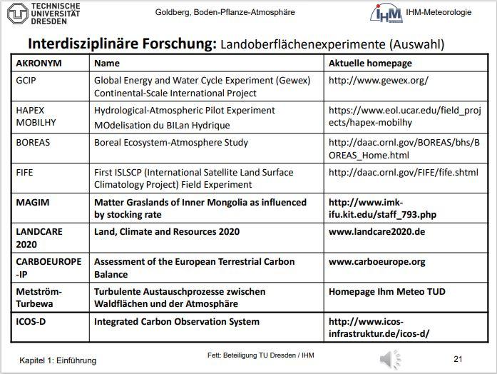 Bild aus Skript[@S-BPA]

## Skalenbetrachtung und raum-zeitliche Abhängigkeit des Systems BPA

### Raum-Zeit-Skala

-   Skale der Landoberfläche bestimmt **Skale der Wechselwirkung** mit
    der Atmosphäre
-   Generell ergolgt bestimmter Raum-Zeit-Bezug im System BPA durch
    **dominierende Prozesse**
-   Jedoch: Prozesse innerhalb des Systems haben, abhängig von
    betrachteter Komponente, unterschiedlichen Raum-Zeit-Bezug
-   Intensität und Wahrnehmbarkeit der Wechselwirkung wird bestimmt vom
    Grad der Kopplung LOF-Atmosphäre, die von der Komplexität der LOF
    abhängt (z.B. Wald-starke Wechselwirkung, Kurzgras-schwache
    Wechselwirkung)

Raumliche und zeitliche Skalen sind eigentlich anhängig, die Skalen
werden in der Regel in **Makro**, **Meso**, **Local** und **Micro**
geteilt.

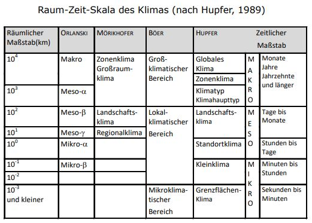

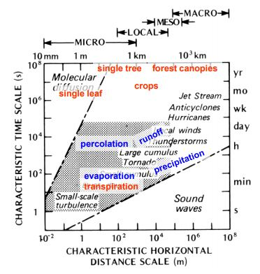

Nach Smagorinski, 1974; aus Skript[@S-BPA]

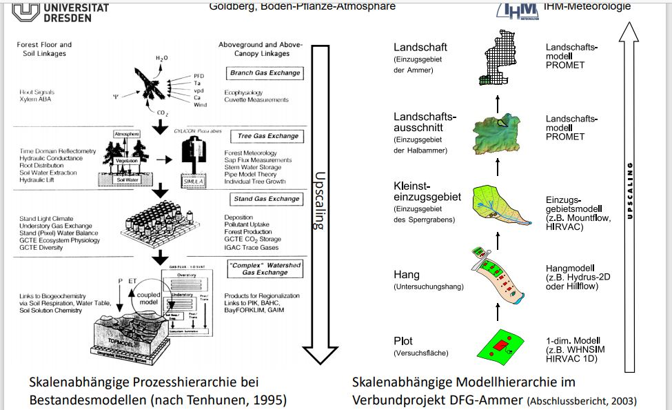 Bedeutung eines Prozesses und des
entsprechenden Werkzeugs zur Prozessbeschreibung hängt ab von der
**betrachteten Skale**![@S-BPA]

### Raum-zeitliche Wechselwirkung von Klima und Landschaft

-   Benachbarte Kleiklimate beeinflussen sich **wechselseitig**
-   Die Intensität der Wechselwirkung hängt von **Größe** und
    **Komplexität** der Landnutzungsstrukturen ab
-   Die Charakteristik der Wechselwirkungen wird gesteuert über den
    **Energie- und Stoffaustauschen** zwischen Landschaft und Atmosphäre

### Globale und regionale Wechselwirkungen und Rückkopplungen

-   Rückkopplung zwischen **Energie- und Stoffaustausch** und den
    "**Antriebskräften**" des Austauches (Gradienten, Randbediengungen)
-   Charakter der Wechselwirkung abhängig vom **Raum-Zeit-Maßtab** der
    **beteiligten Komponenten**: linear: gleicher Maßstab; nicht-linear:
    unterschiedlicher Maßtab

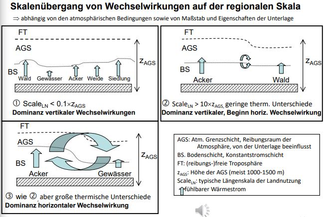

Bild aus Skript[@S-BPA]

1.  Sca~LN~ \< 0.1$\times$z~AGS~: Dominanz **vertikaler** Wechselwirkung
2.  Sca~LN~ \> 10$\times$z~AGS~ und **geringe therm. Unterschiede**:
    Dominanz **vertikaler**, Beginn horiz. Wechselwirkung
3.  Sca~LN~ \> 10$\times$z~AGS~ und **große therm.
    Unterschiede**:Dominanz **horizontaler** Wechselwirkung

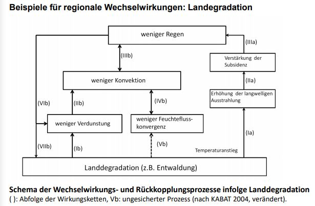

Bild aus Skript[@S-BPA]

Schema der Wechselwirkungs- und Rückkopplungsprozesse infolge
Landdegradation

## CO2-Düngeeffekt

Antieg der regional differenzierten Karkonisationsrate in den
wichtigsten Nahrungsmittelpflanzen bei einer Erhöhung der
atmosphärischen CO2-Konzentation um 100 ppm.

"Ergünunug" der Erde durch CO2-Düngung $\rightarrow$ Zunahme der
Biomasse (LAI)

Kompensation des anthropogenen, CO2-Anstieges in der Zukunft durch mehr
C-Aufnahme der Pflanzen:

-   Antsieg der Respiration

-   Sättigungseffekt (Anpassung der Pflanzen an SO2-Anstieg, Nachteil
    für C4-Pflanzen)

-   Limitiertes Nähstoffangebot im Boden

-   Änderung Wasserhaushalt (Limitierung durch Trockenheit)

## Systemkomponenten

Space free atmosphere

entralnment layer \| 0.1**z~f~**

mixed layer

surface layer \| 0.1**z~f~**

merge layer \| 3**h~v~**

vegetation \| **h~v~**

## Energie- und Stoffflüsse

Unterschied zur unbewachsenen Oberfläche:

-   primäre Energieumsatzfläche (meidt) nicht mehr am Erdboden, sondern
    im Breich der maximalen Konzentration an Biomasse der Vegetation

-   sekundäre Umsatzfläche an der Erdoberfläche

-   Partitionierung der Flüsse zwischen den Umsatzflächen erfolgt i.
    allg. über die Verwendung von (linearen) Gewichtsfunktionen

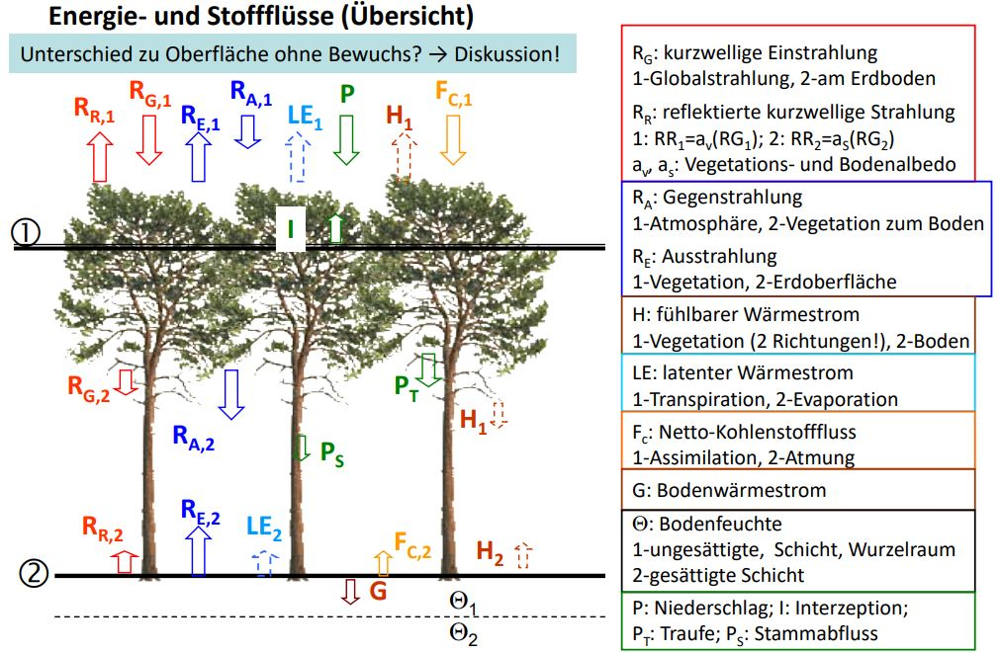

Bild aus Skript[@S-BPA]

Bestimmung von Gebietsmitteln in einer fraktionierten Landschaft
$\rightarrow$ Kombination der flächengewichteten Anteil der Energie un
Stoffflüsse

$$
F=f_vF_1+(1-f_v)F_2
$$

$F$: Energie- oder Stoddluss, $F_1$: primäre, $F_2$: sekundäre
Umsatzfläche, $f_v$: Vegetationsanteil des Landschaftsausschnitts

## Raum-Zeit_Verhalten der Systemgröße

### Strukturparameter der Vegetation:

1.  Kronenschlussgrad: Anteil des durch Vegetation überdeckten
    Himmelsbereich

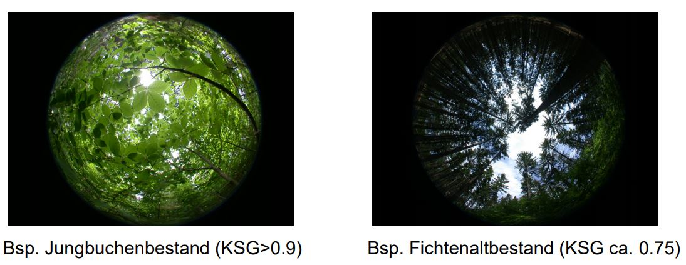

Bild aus Skript[@S-BPA]

2.  Bestandeshöhe: mottlere Wuchshöhe der Vegetation (**h~v~**)
3.  Blattflächendichete (leaf area density, plant area density)

$$
LAD=\frac{Gesamtoberfläche\,der\,Blätt\,(Vegetationselemente)}{Einheitsvolumen} \bigg[\frac{m^2}{m^3}\bigg]
$$

4.  (kumalativer) Blattflächenindex ((cumulative) leaf area index, plant
    area index)

$$
LAI=\frac{Gesamtoberfläche\,der\,Blätt\,(Vegetationselemente)}{Grundfläche^*} \bigg[\frac{m^2}{m^2}\bigg]
$$

$$
LAI=\int_0^{h_v}LAD(z'){\rm d}z'
$$

$$
CLAI=\frac{Gesamtoberfläche\,der\,Blätt\,einer\,Teilschicht}{Grundfläche^*} \bigg[\frac{m^2}{m^2}\bigg]
$$

$$
CLAI(z)=\int_z^{h_v}LAD(z'){\rm d}z'
$$

5.  Albedo
6.  Formwiderstand (form drag)

$$
c_d=\frac{\tau_0}{\rho \int_0^{h_v} u(z)^2 LAD(z){\rm d}z}
$$

$\tau_0$: Schubspannung am Oberrand der Vegetation, $u(z)$: horizontale
WIndgeschwindigkeit

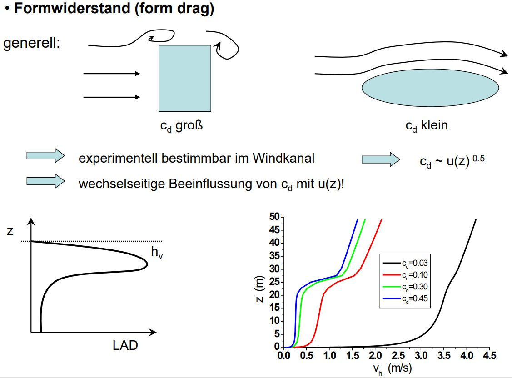

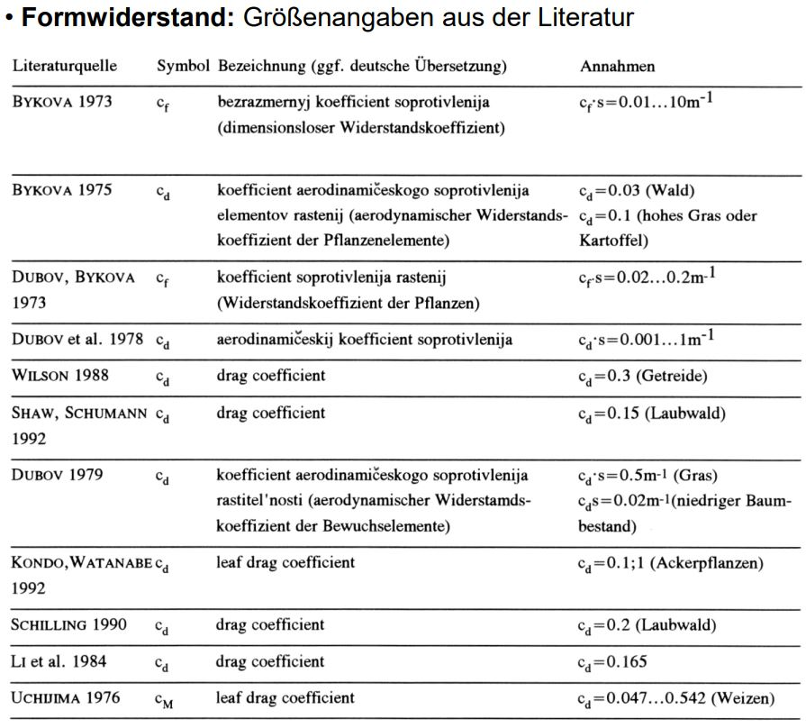

Bild aus Skript[@S-BPA]

### Merkmale des Klimas von Vegetationsräumen

#### Strahlung

1.  Kurzwellige Absorption

Beersches Gesetz:

$$
K_{w,0}=R_G\,e^{-\frac{b\,LAI}{{\rm sin}\gamma}}
$$

$K_{w,0}$: kurzwellige Einstrahlung am Erdboden im Bestand, $R_G$:
Globalstrahlung über dem Bestand, $b$: Extinktionskoeffizient (b=0.5)
für zufällige Blattverteilung, $LAI$: Blattflächenindex, $\gamma$:
Sonnenwinkel.

bzw.

$$
K_{w}(z)=R_G\,e^{-\frac{b\,CLAI(z)}{{\rm sin}\gamma}}
$$

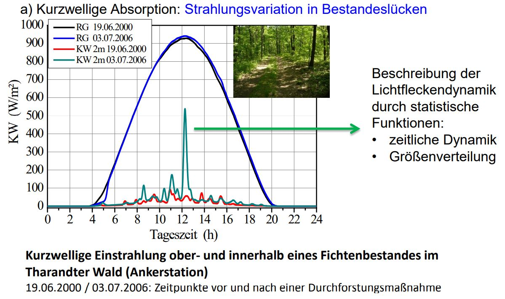

-   zeitliche Dynamik

-   Großenverteilung

2.  langwellige Strahlung

Absorption und Reemission der biomasse, abhängig von kurzwelliger
Strahlungsbilanz, Temperatur und Vegetaionsanteil an Gesamtoberfläche.

Hirvac:

$$
R_{A,V}^*=(1-\sigma_V)R_A+\frac{\sigma_V(R_{E,V}+(1-\epsilon_V)R_{E,V})}{\epsilon_V+\epsilon_S-\epsilon_V \epsilon_S}
$$

$\sigma_V=1-e^{0.5LAI}$ Abschttungsfaktor für isotrope Strahlung,
$\epsilon_S$, $\epsilon_V$, $\epsilon_A$: Emissivität von Erdoberfläche,
Vegetation und Atmosphäre.

3.  Strahlungbilanz

-   Kombination des Vegetationseinflusses auf kurzwellige und
    langwellige Bilanz, dominiert von kurzwelliger Absorption

-   häufig Anwendung des Beerschen Extinktionsansatzes für die
    strahlungsbilanz

Ansatz nach Impens und Lemeur, 1969:

am Erdboden:

$$
R_{N,0}=R_{N,h}\,e^{-0.622\,LAI+0.055\,LAI^2}
$$

im Niveau z

$$
R_{N}(z)=R_{N,h}\,e^{-0.622\,CLAI(z)+0.055\,CLAI(z)^2}
$$

über der Vegetation:

$$
R_{N,h}=-R_{E,V}+R_A+(1-a_V)R_G
$$

#### Temperatur

Temperaturregime im Vegetationsraum ist eng gekoppelt mit
Strahlungsregime:

-   Absorption am Tage $\rightarrow$ Temperaturmaximum im Kronenraum

-   nächtliche Differenzen gring

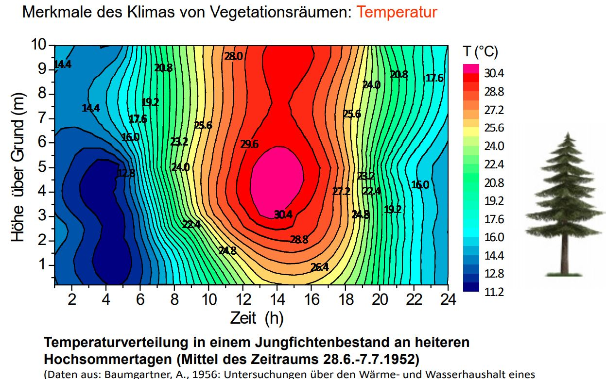

#### Feuchte

Feuchteregime des Vegetationsraumes abhängig von Unterlage (Evaporation)
und Aktivität der Biomasse (Transpiration)

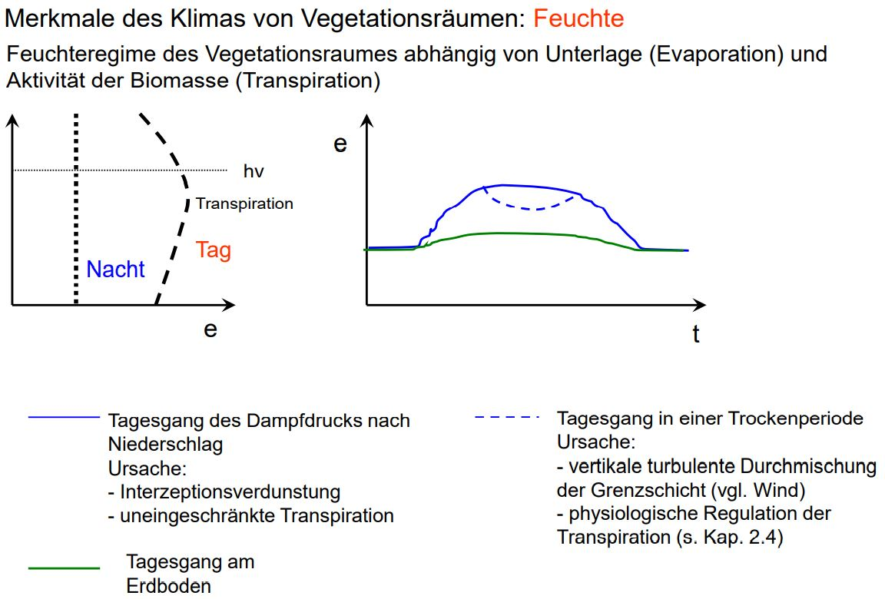

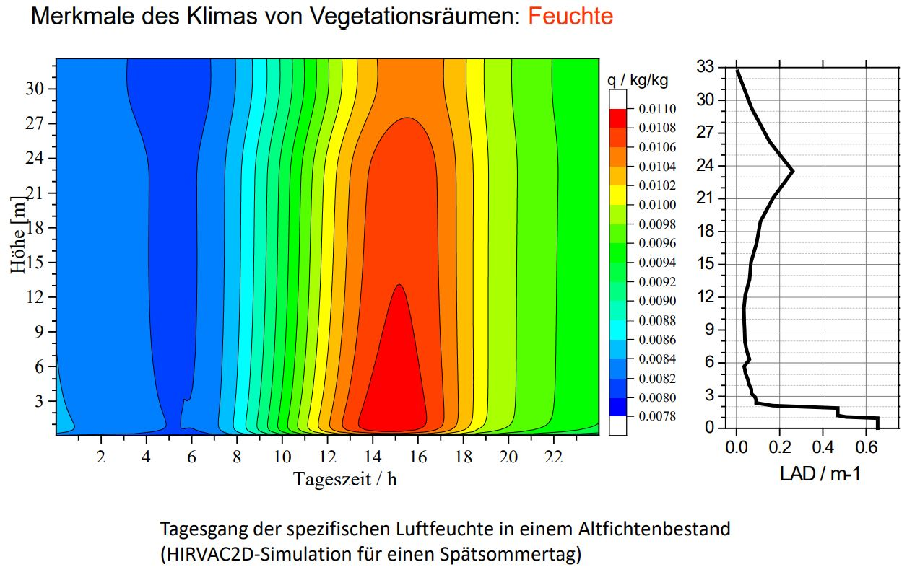

#### Wind

Windregime des Vegetationsraumes abhängig von der Vegetationsverteilung

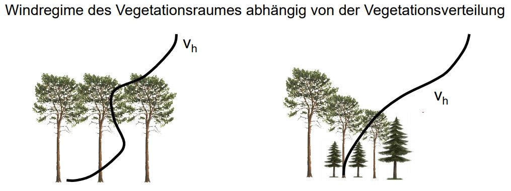

Exponentialansatz:

$$
v_h(z)=v_H\,e^{a(z/H-1)}
$$

$a$: Extinktionskoeffizient, $v_h(z)$: Windgeschwindigkeit in der Höhe
z, $v_H$: Windgeschwindigkeit in Bestandeshöhe.

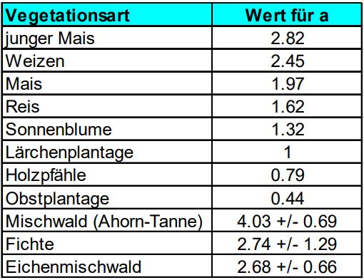

für $z H$:

$$
v_h(z)=\frac{v_*}{K}{\rm ln}\frac{z-d}{z_0}\qquad d=\frac{2}{3}H\qquad z_0=0.1H
$$

$$
v_i=v_j(\frac{z_i}{z_j})^c\qquad v_j=v_i(\frac{z_j}{z_i})^c
$$

**??was ist i und j**

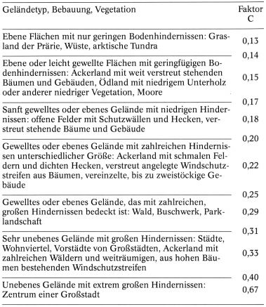

Rauigkeitsparameter (Exponent) im Potenzwindgesetz (aus Häckel,
Meteorologie, 1993)

#### Turbulente Wärmeströme

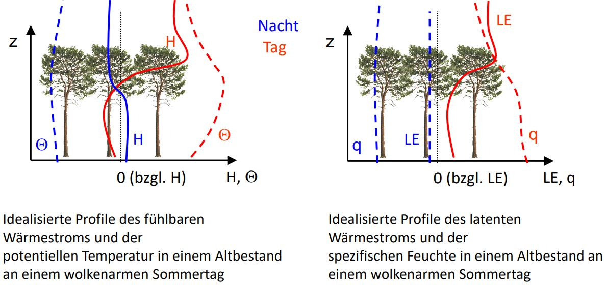

$$
H=-\rho c_PK_H\frac{{\rm d}\Theta}{{\rm d}z}
$$

$$
LE=-\rho LK_E\frac{{\rm d}q}{{\rm d}z}
$$
