# FLOOD RISK MANAGEMENT I {#FRM1}

Integrated risk management of flood events requires complex,
trans-disciplinary approaches. The module focuses on the relevant
physical processes of flood risks for a comprehensive risk analysis.

## Framework of Integrated Flood Risk Management

This section is based on the lecture "A Framework of Integrated Flood
Risk Management"[@S-FRM1-0].

### Basic terms

A flood is a **temporary** covering of land by water outside its
**normal confines**.(FLOODsite-Consortium 2009)

**Typology**

*Type of flood* (site):

-   Plain floods
-   Flash floods
-   Estuarial floods
-   Coastal floods
-   Pluvial floods

*Cause of event*:

-   Cyclone rainfall floods
-   Snowmelt floods
-   Sea surge and tidal floods
-   Urban sewer floods
-   Dam break or reservoir control floods

from "Flood Protection" towards "**Flood Risk Management**"

Defination: The paradigm change is based on the recognition that
absolute flood protection is unachievable and unsustainable, because of
high costs and inherent uncertainties.

Flood risk is understood as probability of **negative consequences** due
to floods and can only be reduced to a tolerable level.

Flood risk management considers all relevant processes of the **flood
hazard** and the **flood vulnerability** to govern flood risks.

Risk = **probability** \* (negativ) consequence [not certainly]

Flood risk = flood hazard \* (exposure) \* flood vulnerability

vulnerability = value/function \* susceptibility \* coping capacity

Risk = f(Hazard, Vulnerability)

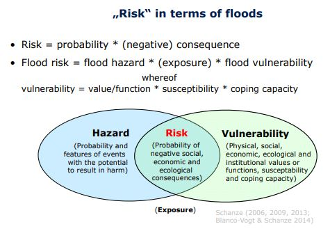

Bild aus Schatze [@S-FRM1-0].

**Flood hazard** A **physical** event, phenomenon or human activity with
the potential to result in harm. A hazard does not necessarily lead to
harm.

Hazards are normally described as the **probability** of flood events
with a certain magnitude and other features.

**Flood vulnerability** Characteristic of a system that describes its
**potential to be harmed**. It covers physical, social, economic,
ecological and institutional aspects.

Areas of Vulnerability direct / indirect tangible / intangible

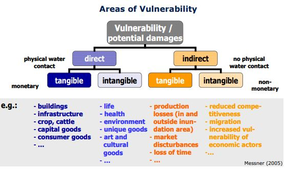

Bild aus Schatze [@S-FRM1-0].

### Main causal relations within the flood risk system

Source $\rightarrow$ pathway $\rightarrow$ receptor $\rightarrow$
consequence

Flood risk = f(f~source~(probability, features), f~pathway~(inundation,
attributes), f~receptor~(susceptibility), f~consequence~(value, coping
capacity))

### Task and components of flood risk management

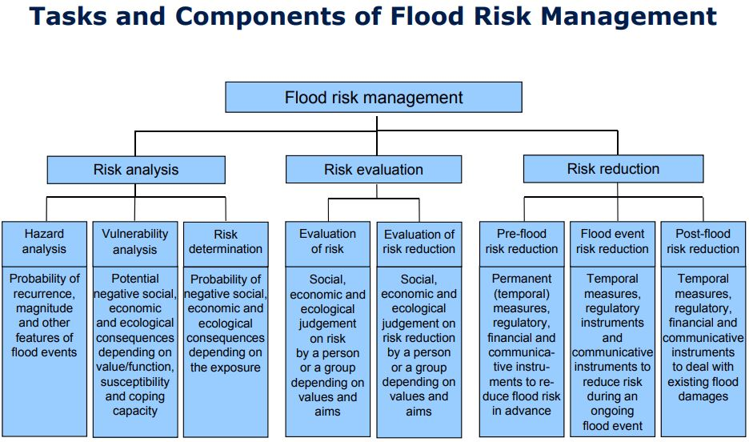

Bild aus Schatze [@S-FRM1-0].

Flood risk management = **analysis** + **evaluation** + **reduction**

Hazard analysis: **Quantification** of magnitude and other features.

Vulnerability analysis: **Quantification and qualification** of
potential adverse social, economic and ecological impacts due to
flooding.

Risk determination: Methofology to caculate the nature and extent of
flood risk.

Evaluating risk: **Methods** of tolerability aversion, sustainability
and so forth depending on individual or collective interest, values and
aims.

Evaluating risk reduction: Individual measures and instruments in terms
of their intended performance and their relation to side-effects.

Pre-flood risk reduction: Measures and instruments including their
operationalisation for modeling resulting risks ex ante and the planning
and implementation process.

Flood event risk reduction:

Post-flood risk reduction:

## Rainfall climatology and Climate Change

Zusammenfassung aus [@S-FRM1-1].

### Means and Extremes

variability

-   Spatial variability: smaller (regional and local) variability
    dominates; influences of orography, exposure to general circulation
    pattern and influence of temperature (latitude).

-   Time variability: Periodic cahnges (e.g. seasonal cycle); Aperiodic
    changes (e.g. short events $\rightarrow$ high intensity)

-   Precipitation extremes: frequency and probability

#### Recurrence interval:

Pe: exceedence probability

Pc: cumulative probability, Pc = 1 - Pe

T: Return period, T = 1/Pe, indicates the expected number of years that
need to be considered to find the value of the variable in study.

TU: The upper confidence of return periods can be found respectively as:
TU = 1/(1-U)

TL: The lower confidence of return periods can be found respectively as:
TL = 1/(1-L)

#### Rainfall Distribution in context

Stratiform Precipitation:

Low indensity, long lasting (\> 6h), wide spread $\rightarrow$ pre-event
moisture

Convective Precipitation:

High intensity (Starkregen \> 17 mm/h, Wolkenbruch \> 60 mm/h), short
duration (\> 6 h), small scale $\rightarrow$ flash floods

Starkniederschlag:

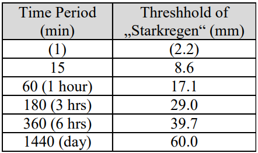

#### Statistics of precipitation extremes

Basic: long-term series of mearsured precipitation (30 a not enough, if
possible 100 a or more)

Example for constructing:

1.  Sorting the serices (Max $\rightarrow$ Min) per year
2.  Selection of the maxima of each year
3.  Result: a series of annual precipitation maxima
4.  Adaptation of theoretical distribution of extremes (Gumbel) to the
    measured precipitation series by regession

### Climate Change

Background: Green House Effect

GHG(Green house gases):CO~2~, CH~4~, N~2~O, O~3~, FCCH, etc.

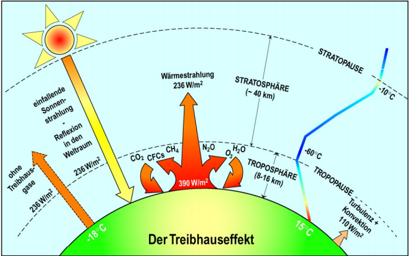

Bild aus [@S-FRM1-1].

Main excepted characterisics

-   Sea level rise

-   Higher temperatures - espesisally on land

-   Hydrological cycle more intense

-   Changes at regional level can differ (but hard to tell)

#### Extreme precipitation

1.  Statistical approach: Probability distribution fitted to the full
    data sample used instead
2.  design precipitation, SHP(D, T) = height(duration, return)

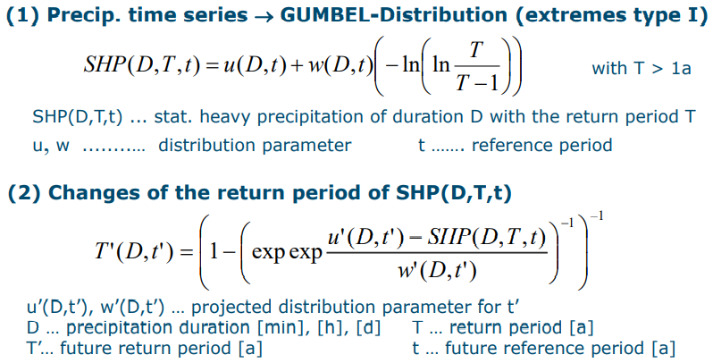

Bild aus [@S-FRM1-1].

## Hydrological aspects of climate change

Zusammenfassung aus [@S-FRM1-2].

### Snow

Snow parameters:

-   snow cover duration

-   snow cover time

-   continuance of the longst snow cover period (winter cover)

-   beginning (date) of the maximum snow vover depth

-   constancy of the snow cover

-   retention of the winter cover

-   maximum value of the water euivalent of the snow cover

### Model Chain Insecurity GCM-RCM

Emissionsszenario $\rightarrow$ Globales Klimamodell (GCM) $\rightarrow$
Regionales Klimamodell (RCM) $\rightarrow$ Wasserhaushaltmodell (WHM)

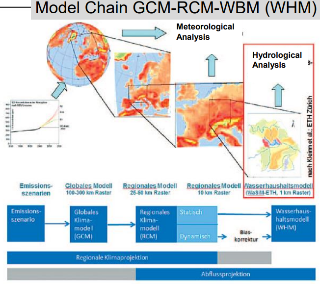

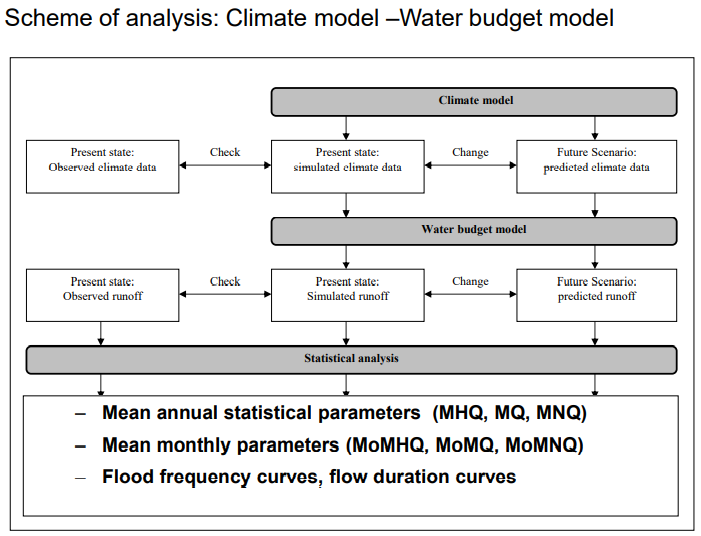

Bilder aus [@S-FRM1-2].

## Physical Processes of Floods

Zusammenfassung aus [@S-FRM1-3].

### Modern weather forecast

-   Computer based caculation of time-dependent change (prognosis) of
    all relevant atmospheric quantities (wind, temperature, humidity,
    density, pressure)

-   Solving of a system of non-linear differential equations including
    the above mentioned quantities

-   Computer simulation satrts with predescribed innitial conditions,
    and the caculation ends with one final solution (deterministic
    model)

#### Types and temporal ranges of weather forecast

-   Nowcasting: Next two hours, onlky use of observations (e.g.,
    tracking algorithms for echoes in radar images), without
    representation of atmospheric physics, e.g., assumption of
    persistence

-   Short-range: 18-24 hours, daily weather

-   Medium-range: 3-10 days, weather for the week ahead

-   Long-range: \> 10 days, further outlook; Comparison of cumulative
    precipitation forecast of one simulation for different models
    $\rightarrow$ measure of uncertainty

#### Physical background of precipitation forecast

Cloud microphysic schemes

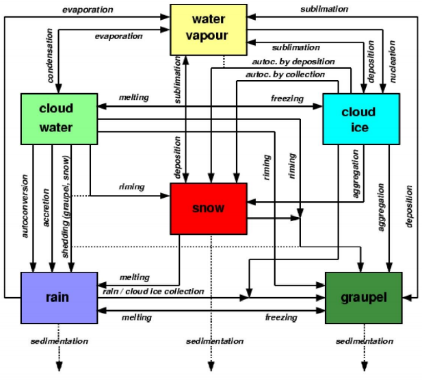

-   Graupel has much higher fall speeds compared to snow

-   Conversion processes, likesnow to graupel conversion by riming, are
    very difficult to parameterize but very important in convective
    clouds. Particle density and fall speeds are important parameters.

#### Ensemble simulation

-   Ensemble

    -   estimation of the natural variance of output quantities

    -   check of the stability of mid-range forecast

Precipitation forecast is based on ensemble siomulations and probalities

Flow diagram

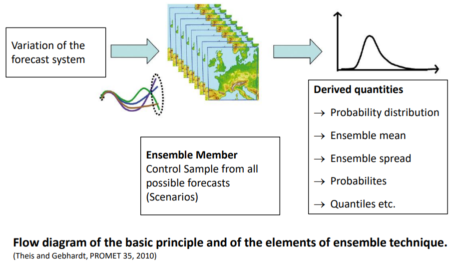

### Evaluation of forecast quality

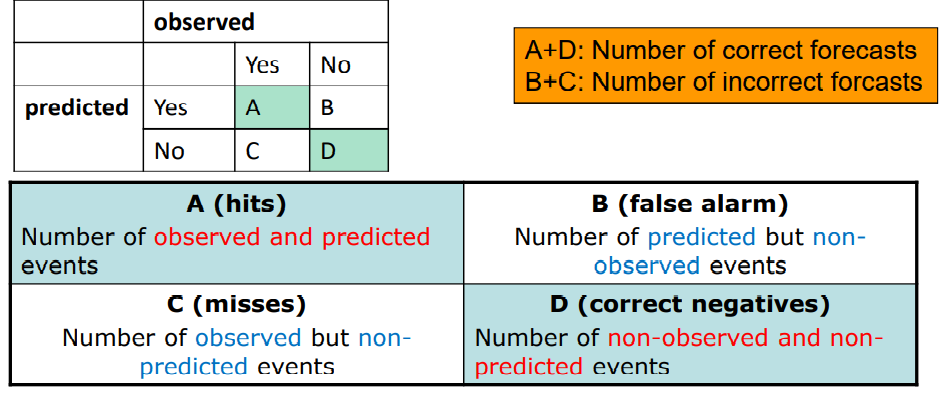

Probability of detection (Hit Rate)

Measures the fraction of observed events that were correctly predicted.
Sensitive to hits, good for rare events, Ignores false alarms.

$$
POD=\frac{hits}{hits+misses}
$$

Threat score (critical success index)

Measures the fraction of observed and/or forecast events that were
correctly predicted. Sensitive to hits, penalizes both misses and false
alarms. Does not distinguish source of forecast error. Depends on
climatological frequency of events (worse scores for rarer events) since
some hits can occur purely due to random chance.

$$
TS=\frac{hits}{hits+misses+false\,alarms}
$$

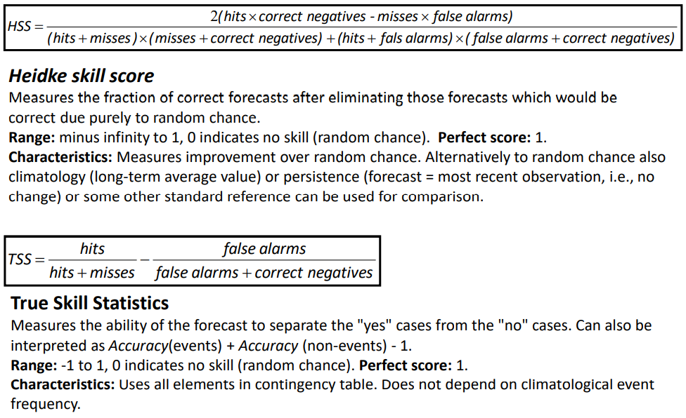

### Limits of weather forecast

Dependency on forecast method and forecast period

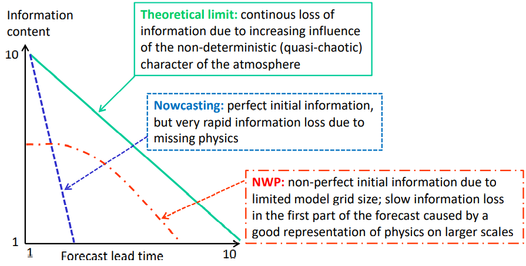

Reasons

-   Erroneous initial conditions for modelling (erroes in measurements
    and data interpolation)

-   Inadequate model resolution: small-scale heavy rainfall can not be
    simulated, orographically induced rainfall is underestimated

-   Inadequate model physics (convective precipitation, precipitation is
    only a diagnostic quantity and must be derived from other model
    output)

-   Inadequate methods of data assimilation (e.g., not all data sourecs
    can be considered in time)

-   Problems with interpretation of model results by the experts (ma
    made errors)

## Radar

Zusammenfassung aus [@S-FRM1-4].

Radar (radio detection and ranging):

-   active remote sensing System

    -   sending of micro- or radio waves (MHz- and GHz-range)

    -   recieving of reflected radition

Radiometer (passive remote sensing system $\rightarrow$ measurement of
emitted radition)

Goals of Radar:

-   Distance

-   Speed

-   Form and size of obstacles

-   Obstacle structure/ consitency

-   Land surface eploration through clouds

Opareting system

-   Ground-based, planes

-   Satellite-base (orbiting satellites)

### Radar System

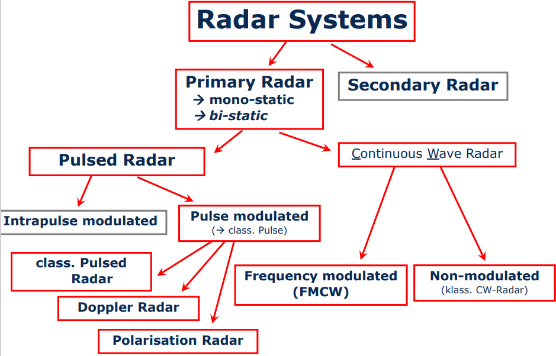

Pulsed Radar

-   Transmission of highly collimated EM-Waves of the antenna
    $\rightarrow$ small collimated Pulses

-   Propagation of radation in small and long angles (Radar-Beam) with
    light speed $\rightarrow$ Pulse reaches an obstacle $\rightarrow$
    Reflection (exactly Scattering)

-   Receiving of back scattered radition signal

-   Pulse with diferent Polarisations

    -   Quotient of horizontal to vertical reflectivity differes from
        the drop shape differes

    -   large drops are flat

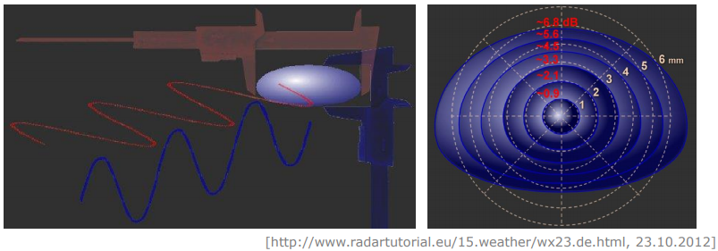

Doppler Radar: Measurent of radial speed

-   Derivation of horizontal wind speed

-   Wind speed is an indicator for precipitation type

Polarisation Radar: Difference of drop shape from shpere

-   Measure for the drop size

-   Derivation of precipatation $\rightarrow$ large drops / stratiform
    precipitation

Estimation of radar errors:

-   A radar measurement is instant in time, raingauge measurement is
    continuous

-   radar detectes precipitation in a certain height above ground
    depending on the beam angle $\neq$ ground precipitation

-   Anomalous propagation of the radar beam, due to a non standard
    distribution of temperature and humidity with height in the
    atmosphere

-   Pantom precipitation: multi reflection in dense clouds $\rightarrow$
    increase of signal run time $\rightarrow$ wrong estimation of rain
    rates

-   Overestimation due to Bright-Band effect

-   Radar artefacts, Static and moving Clutters (Wind mills, Towers,
    Planes, Insects); Spokes (Completly blocked beam)

### Radar based forecast

Nowcasting = NOW + FORECASTING

-   Characterisation of rainfields: size, mass, centre of gravity, aces
    of inertia, angle of axes, class distribution, past movment, last
    size difference, last mass diferencr, number of successful tracks

-   Extrapolation of rainfields: Linear moment, Dynamics for certainty
    estimate, Interpolation of image possible, Orographical effects
    after analysis of data

------------------------------------------------------------------------

hazard, flood hazard, danger

institutional,

receptor,

impact,

collective, individual or collective

sustainability,

magnitude,

derive,

Inadequate
