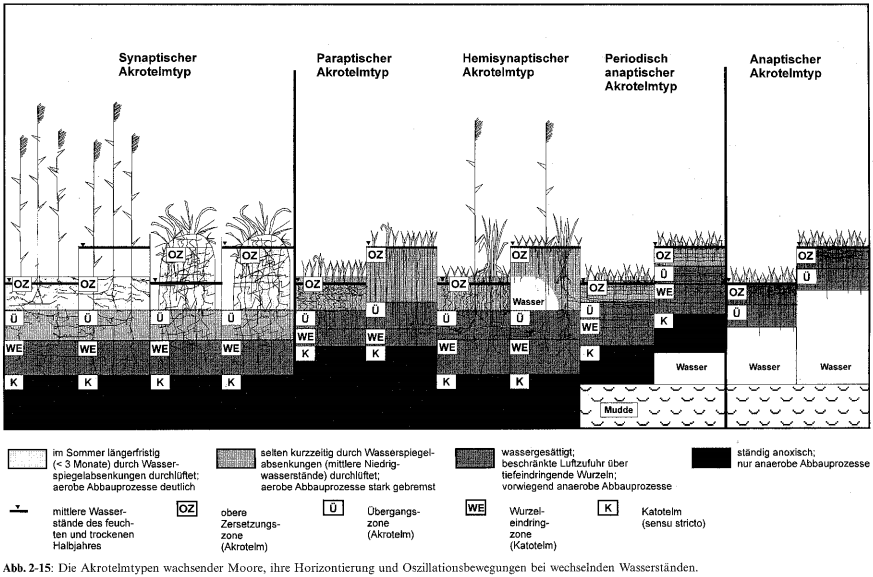
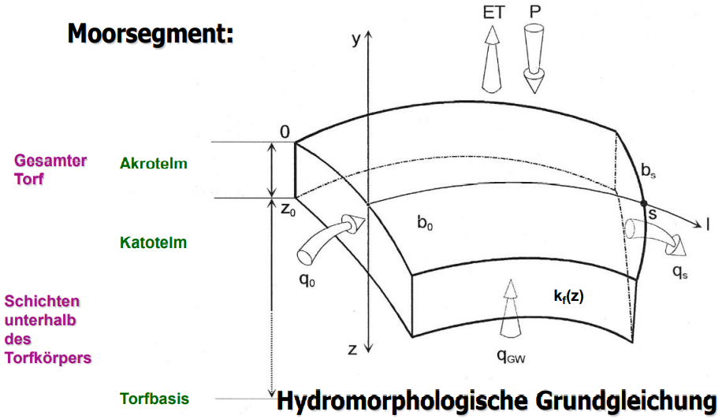
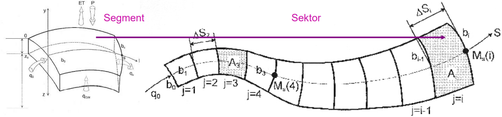

# Regionale Hydrologie

Inhalt des Moduls sind die Aspekte der Regionalisierung hydrologischer Größen, des Maßstabsproblems in der Hydrologie und der regionalen Bestimmung hydrologischer Parameter in unbeobachteten Gebieten.

## Moorhydrologie für Hydrologen

In diesem Abschnitt ist eine Zusammenfassung aus dem Vertrag "Moorhydrologie für Hydrologen" [@S-REG-Moor].

### Allgemeine Begriff

**Moore** sind "Landschaften ..., in denen **Torf gebildet** wird oder oberflächig anseht. Es werden damit auch *Lebensräume* eingeschlossen, in dennen noch **kiene deutlichen Torfschichten vorhanden** sind, ..., in denen jedoch **Torfbildung möglich** ist." (Joosten and Succow 2001, S. 2)

Geologische (rohstoffwirtschaftliche) und bodenkundliche Difinitionen: die von Mindest**trof**mächtigkeiten ausgehen: 20, 30, 50, 80, 120.

Problem: **Schnelle Veränderlichkeit** gringer Torfmächtigkeiten.

**Torf** (Koppisch 2001, S.8)

-   eine organische, sedentäre (von untern nach oben aufgewachsene) Ablagerung

-   äberwiegend aus abgestorbenem, humifiyiertem Pflanzematerial besteht

-   das (meist auf Grund eines durch wassersättigung verursachten Sauerstoffmangels) nicht vollständig abgebaut wurde und

-   dessen Sturktur zumindest teilweise noch erkennbar ist

Torfarten:

-   **Moostorfe**: Braun**moos**torfe mit Untergruppen

-   **Riedtorfe**: Woll**gras**, Blasenbinse, Grobseggen, Fein**seggen**, Salzweiden, binsenschneide, Schilf, Pfeiffengras ...

-   **Holztorfe**: Kiefer, Fichte, Birke, Erle, Eberesche, Reiser

-   amorpher Torf

Humosität der Torfe, Humus

Limnische Moorsubstrate / -sedimente --= Mudden, anorganische See- und Quellsedimente

### Wachsenden Moore: Akrotelm und katotelm

moorhydrologische Hauptsatz 1.

Das Wasser muss im langfristigen Mittel nahe an, in oder über der Oberfläche stehen, damit Torf akkumuliert wird, das Moor also wächst. (Schneebel mdl. 1991)

Akrotelm: der obere Bereich wassersender Moorökotope und umfaßt den Moorboden und die Vegetationsschicht, sofern in dieser Porenstrümung stattfinden kann. (Stegmann, Edom und Koska 2001)

Katotelm: der ständig wassergesättigte Bereich des Torfköpers mit relativ geringer biologischer Aktivität.

moorhydrologische Hauptsatz 2.

Durch Oxidationsprozesse (Belüftung, loneneintrag) und Druck (Auflastveränderung) verändern sich die hydaulischen Eigenschaften des Torfes, insbesondere verändern (meist verringern) sich die Porengrößen und damit Porositäten, Speicherkoeffizient und hydauliche Leitfähigkeit. (Edom 2001)

Moorentwässerung führt zu:

-   weitreichende Bodenstrukturänderungen (Degeneration, Degradation)

-   Freisetzung von Nährstoffen (P, N) und anderen Stoffen (SO4, DOC Huminstoffe)

-   Verbrennung von Torf zu CO2 ???

-   Schrumpfung des Reliefs

-   Verlust an Biodiversität bzw. wertvollen / seltenen Arten / Biotopen

Das Ausmaß dieser Prozesse ist hydrologieabhängig

Umwelt- und Naturschutzprobleme steigen mit Grad der Degradierung

### Bedeutung der Moore

1.  Biodiversität: Arten-, Biotop- und Prozessschutz: Eigenwert der Natur
2.  Gewässerschutz bzw. -verschmutzung: P, N, S, Fe, DOC
3.  Bestandteile von Gewässereinzugsgebieten und wasserwirtschaftlichen Systemen, häufig Quellgebiete von Flüssen oder flussbegleitend (Wasserregulierungsfunktion)
4.  Klimaschutz: Kohlenstoffspeicher (- doppelt soviel wie in Wäldern der Erde), klimarelevante Gase, Verdunstungskühlung, Feuer-Gefahrenquelle
5.  entwässerungsabhägige Nutzungen: Torfabbau, Landwirtschaft, Forstwirtschaft
6.  "nasse" Nutzungen: Paludikulturen (Wasserwälder, Halmniomasse, Torfmoose), Nahrungserwerb (Beeren, Jadg), Medizin (Pflanzen, Huminstoffe)
7.  Identität, Schönheit, Ästhetik sowohl von natur- als auch Kulturlandschaft
8.  Informationsfunktion, z.B. Speicherung der Vergangenheit (Leichen, Siedlungsreste, Pollen, Pflanzenreste, Hüttenstäube u.a.)
9.  Kulturhistorische Barrierefunktion und räumliche Schutzfunktion natürlicher bzw. nasser Moore
10. Trägerfunktion (Bebauung, Infrastruktur), Gfängnisse, tiefere Lagerstätten (v.a. Öl und Gas)

### Moor- und Torfbrände

In der Anfangsphase meist als Flächenbrände --= schwarzes Land

Torfbrände in der fortgeschrittenen Phase, meist in entwässerten Mooren als besonders extreme Moordegeneration =-- wasserstands- und feuchte-anhängig.

Pyroyse auch bei Saustoffabschluss und bei scheinbar gelöschtem Brand

"Glutnester" meist in der Pyrolysezone, auch beim Torfkoks.

Gringe Wärmeleitfähigkeit von Torf =-- "Glutnester" können überwintern und Brandherd kann im Frühjahr/ Sommer wieder erneut "auflammen"

### Vegetations-Wasser-Abhängigkeiten

Durch den Torfbildungsprozeße sind stabile Vegetationsformen sowohl Folge als auch Ursache satndörtlicher hydrologischer eigenschaften. deshalb ist der Zusammenhang zwischen hydrologiscchen eigenschaften und Vegetationsbedeckung in wachsenden Mooren besonders eng.

### Wasserstand und klimarelevante Gase

Kohlendiocid, Methan, Lachgas

gasaustauschen

### Hydraulik von Moorböden und Torf

#### Akrotelm (oberflächenah natärl. Moor)

Entwässerbare Porosität (Speicherkoeffizient)

$$
n_e(z)=n_{Kat}+(n_0-n_{Kat})\cdot e^{\frac{-z}{m}}
$$

Hdraulische Leitfähigkeiten: (Edom et al. 2007)

$$
k_f(z)=k_{Kat}+(k_0-k_{Kat})\cdot e^{\frac{-z}{m}}
$$

(Edom 2001)

$$
k_f(z)=\frac{k_0}{(z+1)^m}
$$

#### Katotelm

Abhängig von Torfart, Humositätsgrad / Zersetzungsgrad H, substanzvolumen SV. (succow & Joosten 2001)

Veränderungen kf-Werte mit der Zeit

"Durch Oxidationsprozesse ... und Druck ... verändern sich die hydraulischen Eigenschaften des torfs, insbesondere verändern (meist verringern)sich die ... hydraulische Leitfähigkeit." (Edom 2001)

Kosov 1987:

$$
k_f=k_0(T+1)^{-m_{KOS}}
$$

$T$ ist ENtwässerungszeit in Jahren;

$m_{KOS}$ von Entwässerungsität und Torfart abhängiger Koeffizient

Unndin 1964:

$$
k_f=k_0\cdot e^{-cz_E}
$$

$z_E$ in m für Landwirdschaft und Düngung, $c$ ist die Koeffizient zur Brücksichtigung der Zeit

### Die hydroloisch relevante Raumstruktur eines Torfkörpers

Bild aus Kript [@S-REG-Moor].

### Klimarelevante Umgebung

Strahlungsfilterung Romanov-Gleichung (Romanov 1961):

$$
ET_{Mire}=\alpha \cdot RN+Adv
$$

#### Strahlung Bilanz

$$
RN=R_K-R_L
$$

Kurzwellige Einstrhlung $R_K$ (s. Dzck 1980b, Dvwk 1996):

$$
R_K=(1-\mu)\cdot R_{G}=(1-\mu)\cdot R_{ex}\cdot [0.19+0.55(1-w)(1-b_a)(1-b_i)]
$$

(Edom 2001)

$\mu$: Albedo (Reflexionsvermögen) der Mooroberfläche;

$R_G$: beschattungsreduzierte Globalstrahlung, die im Falle $b_a=b_i=0$ (keine Beschattung) der üblichen Globalstrahlung entspricht;

$R_{ex}$: extraterrestrische Strhlung (s. Dzck 1980b, Dvwk 1996);

$(1-w)\cong h/H=t_s$: relative Sonnenscheindauer;

Langwellige Ausstrahlung $R_L$ von Mooroberflächen (nach Bavina 1967 und Autoermkollektiv 1976):

$$
R_L=\sigma T_M^4\cdot {\rm f}(W)\cdot {\rm g}(e)=\sigma T_L^4\cdot {\rm f}(W)\cdot {\rm g}(e)+\Delta R_L
$$

$\sigma=5.67\times10^{-8} \;[{\rm J/(m^2K^4s)}]$: Stefan-Boltzmann-Konstante;

$T_M,\,T_L\;[{\rm K}]$: Temperatur der Moorbodenoberfläche, Lufttemperatur in 2m Höhe;

${\rm f}(W)$: Bewölkungsfunktion nach Efimova (1961) mit:

$$
{\rm f}(W)=1-{\rm c}(\varphi)\cdot W \cong (1-{\rm c}(\varphi))+{\rm c}(\varphi)\cdot t_s
$$

${\rm c}(\varphi)$: von der geographischen Breite $\varphi$ abhängiger Koeffizient, wobei zwischen $45^\circ$ und $75^\circ$nördlicher Bereite gilt:

$$
{\rm c}(\varphi)=0.7+0.004(\varphi-45)
$$

Aber bei allen Penman-Monthith (Penman 1948):

$$
{\rm f}(W)=0.1+0.9t_s
$$

${\rm g}(e)$: Dampfdruckfunktion nach Efimova (1961), in Mitteleuropa die Dampfdruckfunktion (auch Nettoemissivität) der FAO-Richtlinie (s. Doorenbos & Pruitt 1997, Dvwk 1996, Dyck & Peschke 1995) anwendbar:

$$
{\rm g}(e)_{FAO}=0.34-0.044\sqrt{e}
$$

$e$: Dampfdruck der Luft in 2m Höhe in [hPa];

$\Delta R_L$: Ausstrahlungsverbesserung auf den Temperaturunterschied $\Delta T$ zwischen Moorboden- und Lufttemperatur für satbile Luftschichtung (Bavina):

$$
\Delta R_L\cong 4\sigma T^3\Delta T
$$

| Symbol       | Moor       | Apr. | Mai. | Jun. | Jul. | Aug. | Sep. | Okt. | Quelle    |
|--------------|------------|------|------|------|------|------|------|------|-----------|
| Albedo $\mu$ | Hochmoor   | 0.16 | 0.16 | 0.16 | 0.16 | 0.16 | 0.16 | 0.18 | kollektiv |
|              | Niedermoor | 0.10 | 0.17 | 0.2  | 0.2  | 0.2  | 0.18 | 0.16 | 1976      |
| $\Delta T$   | Hochmoor   | 0    | 0.9  | 1.4  | 1.4  | 0.6  | 0    | -0.9 | Bavina    |
|              | Niedermoor | 0.7  | 1.6  | 1.8  | 1.4  | 1.2  | 0.2  | -0.4 | 1967      |

#### Advektive Effekte

Für große Moore, Zentren großer Moore, windgeschütze Moore, Moore in feuchten oder kalten Regionen (Romanov 1962):

$$
Adv=0
$$

$$
ET_{Mire}=ET_\infty 
$$

Für kleine Moore, Randbereiche großer Moore, windexponierte Moore, Moore in trockenen oder Warmen Regionen **Advektion kann dedeutend sein** (Bavina 1967):

$$
ET(x)=ET_\infty+(ET_0-ET_\infty)\cdot e^{-n_ax}
$$

na=??? (Versinin 1976)

### Innere Hydrostruktur vertikal

-   Bodenzonierung

    -   Enge hzdrauliche Schichtung in natürlichen und degradierten Moorböden

    -   Schnelle zeitliche Veränderlichkeit

    -   Hohe räumliche Heterogenität

-   Torfschichtung (Katotelm)

    -   Hydaulische Schichtung nach Torfart und Humifizierung (Zersetzung), Anisotropie

    -   Hydraulische Fenster, stauende und durchlässige Schichten

### Innere Hydrostruktur horizontal

Hydromorphologie ist der Teil der Geomorphologie, der sich mit den wassergeprägten Formenelementen der Landschaft und ihren Interaktionen beschäftigt. Ein Moor sowie seine Teile sind wassergeprägte Formenelmente.

Die Verbindung mit Methoden der quantitativen Hydrologie erlaubt die Erklärung ursächlicher Zusammenhänge, die mathematische Modellierung und die Prognose von wassergeformten Landschaftselementen.

#### Natürliche Moore

In wachsenden Mooren ist das Mesorelief der Mooroberfläche weitgehend parallel zur Moorwasserspiegeloberfläche. Deswegen können die Mesoreliefformen der Moore ebenso wie die Oberfläche des Grundwasserkörpers mit den Methoden der Geohydraulik beschrieben werden. (Edom 2001)

(Ivanov 1975):

$$
\frac{{\rm d}y}{{\rm d}l}(s)=\frac{q_0b_0+\int_0^sp_lb_l\,{\rm d}l}{M_z(s)b_s}=\frac{q_0b_0+\int_0^sp_lb_l\,{\rm d}l}{b_s\int_{z_u}^{z_m}k_f(z){\rm d}z}
$$

Für jedes Segment eines Sektors berechnet sich aus der langjährigen mittleren Wasserbilanz (Edom & Golubcov 1996):

der spezifische Profildurchfluß:

$$
q_s(i)=\frac{q_0b_0}{b(i)}+\frac{\sum_{j=1}^i[A_j(P+q_{GW}-ET)_j]}{b(i)}
$$

die erforderliche (regenerierende, selbsttregulierte) durchströmte Transmissivität (Torfkörper oder Akrotelm):

$$
T_S(i)=\frac{q_0b_0}{b(i)\frac{{\rm d}y}{{\rm d}l}(i)}+\frac{\sum_{j=1}^i[A_j(P+q_{GW}-ET)_j]}{b(i)\frac{{\rm d}y}{{\rm d}l}(i)}
$$

der genetische Mineralwasseranteil (Minerogenie-Quaotient):

$$
H_O(i):=\frac{q_0b_0+\sum_{j=1}^i[A_jq_{GW}(j)]}{q_0b_0+\sum_{j=1}^i[A_j(P+q_{GW}-ET)_j]}
$$

der trophische wirksame Mineralwasseranteil (Minerogenie-Quaotient):

$$
H_U(i):=\frac{q_0b_0+\sum_{j=1}^i[A_jq_{GW}(j)]}{q_0b_0+\sum_{j=1}^i[A_j(P+q_{GW})_j]}
$$
