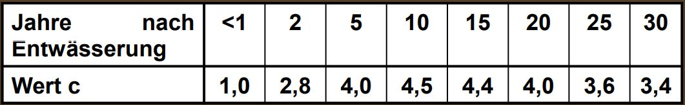

# Regionale Hydrologie

Inhalt des Moduls sind die Aspekte der Regionalisierung hydrologischer Größen, des Maßstabsproblems in der Hydrologie und der regionalen Bestimmung hydrologischer Parameter in unbeobachteten Gebieten.

## Moorhydrologie für Hydrologen

In diesem Abschnitt ist eine Zusammenfassung aus dem Vertrag "Moorhydrologie für Hydrologen" [@S-REG-Moor].

### Allgemeine Begriff

**Moore** sind "Landschaften ..., in denen **Torf gebildet** wird oder oberflächig anseht. Es werden damit auch *Lebensräume* eingeschlossen, in dennen noch **kiene deutlichen Torfschichten vorhanden** sind, ..., in denen jedoch **Torfbildung möglich** ist." (Joosten and Succow 2001, S. 2)

Geologische (rohstoffwirtschaftliche) und bodenkundliche Difinitionen: die von Mindest**trof**mächtigkeiten ausgehen: 20, 30, 50, 80, 120.

Problem: **Schnelle Veränderlichkeit** gringer Torfmächtigkeiten.

**Torf** (Koppisch 2001, S.8)

-   eine organische, sedentäre (von untern nach oben aufgewachsene) Ablagerung

-   äberwiegend aus abgestorbenem, humifiyiertem Pflanzematerial besteht

-   das (meist auf Grund eines durch wassersättigung verursachten Sauerstoffmangels) nicht vollständig abgebaut wurde und

-   dessen Sturktur zumindest teilweise noch erkennbar ist

Torfarten:

-   **Moostorfe**: Braun**moos**torfe mit Untergruppen

-   **Riedtorfe**: Woll**gras**, Blasenbinse, Grobseggen, Fein**seggen**, Salzweiden, binsenschneide, Schilf, Pfeiffengras ...

-   **Holztorfe**: Kiefer, Fichte, Birke, Erle, Eberesche, Reiser

-   amorpher Torf

Humosität der Torfe, Humus

Limnische Moorsubstrate / -sedimente --= Mudden, anorganische See- und Quellsedimente

### Wachsenden Moore: Akrotelm und katotelm

moorhydrologische Hauptsatz 1.

Das Wasser muss im langfristigen Mittel nahe an, in oder über der Oberfläche stehen, damit Torf akkumuliert wird, das Moor also wächst. (Schneebel mdl. 1991)

Akrotelm: der obere Bereich wassersender Moorökotope und umfaßt den Moorboden und die Vegetationsschicht, sofern in dieser Porenstrümung stattfinden kann. (Stegmann, Edom und Koska 2001)

Katotelm: der ständig wassergesättigte Bereich des Torfköpers mit relativ geringer biologischer Aktivität.

moorhydrologische Hauptsatz 2.

Durch Oxidationsprozesse (Belüftung, loneneintrag) und Druck (Auflastveränderung) verändern sich die hydaulischen Eigenschaften des Torfes, insbesondere verändern (meist verringern) sich die Porengrößen und damit Porositäten, Speicherkoeffizient und hydauliche Leitfähigkeit. (Edom 2001)

Moorentwässerung führt zu:

-   weitreichende Bodenstrukturänderungen (Degeneration, Degradation)

-   Freisetzung von Nährstoffen (P, N) und anderen Stoffen (SO4, DOC Huminstoffe)

-   Verbrennung von Torf zu CO2 ???

-   Schrumpfung des Reliefs

-   Verlust an Biodiversität bzw. wertvollen / seltenen Arten / Biotopen

Das Ausmaß dieser Prozesse ist hydrologieabhängig

Umwelt- und Naturschutzprobleme steigen mit Grad der Degradierung

### Bedeutung der Moore

1.  Biodiversität: Arten-, Biotop- und Prozessschutz: Eigenwert der Natur
2.  Gewässerschutz bzw. -verschmutzung: P, N, S, Fe, DOC
3.  Bestandteile von Gewässereinzugsgebieten und wasserwirtschaftlichen Systemen, häufig Quellgebiete von Flüssen oder flussbegleitend (Wasserregulierungsfunktion)
4.  Klimaschutz: Kohlenstoffspeicher (- doppelt soviel wie in Wäldern der Erde), klimarelevante Gase, Verdunstungskühlung, Feuer-Gefahrenquelle
5.  entwässerungsabhägige Nutzungen: Torfabbau, Landwirtschaft, Forstwirtschaft
6.  "nasse" Nutzungen: Paludikulturen (Wasserwälder, Halmniomasse, Torfmoose), Nahrungserwerb (Beeren, Jadg), Medizin (Pflanzen, Huminstoffe)
7.  Identität, Schönheit, Ästhetik sowohl von natur- als auch Kulturlandschaft
8.  Informationsfunktion, z.B. Speicherung der Vergangenheit (Leichen, Siedlungsreste, Pollen, Pflanzenreste, Hüttenstäube u.a.)
9.  Kulturhistorische Barrierefunktion und räumliche Schutzfunktion natürlicher bzw. nasser Moore
10. Trägerfunktion (Bebauung, Infrastruktur), Gfängnisse, tiefere Lagerstätten (v.a. Öl und Gas)

### Moor- und Torfbrände

In der Anfangsphase meist als Flächenbrände --= schwarzes Land

Torfbrände in der fortgeschrittenen Phase, meist in entwässerten Mooren als besonders extreme Moordegeneration =-- wasserstands- und feuchte-anhängig.

Pyroyse auch bei Saustoffabschluss und bei scheinbar gelöschtem Brand

"Glutnester" meist in der Pyrolysezone, auch beim Torfkoks.

Gringe Wärmeleitfähigkeit von Torf =-- "Glutnester" können überwintern und Brandherd kann im Frühjahr/ Sommer wieder erneut "auflammen"

### Vegetations-Wasser-Abhängigkeiten

Durch den Torfbildungsprozeße sind stabile Vegetationsformen sowohl Folge als auch Ursache satndörtlicher hydrologischer eigenschaften. deshalb ist der Zusammenhang zwischen hydrologiscchen eigenschaften und Vegetationsbedeckung in wachsenden Mooren besonders eng.

### Wasserstand und klimarelevante Gase

Kohlendiocid, Methan, Lachgas

gasaustauschen

### Hydraulik von Moorböden und Torf

#### Akrotelm (oberflächenah natärl. Moor)

Entwässerbare Porosität (Speicherkoeffizient)

$$
n_e(z)=n_{Kat}+(n_0-n_{Kat})\cdot e^{\frac{-z}{m}}
$$

Hdraulische Leitfähigkeiten: (Edom et al. 2007)

$$
k_f(z)=k_{Kat}+(k_0-k_{Kat})\cdot e^{\frac{-z}{m}}
$$

(Edom 2001)

$$
k_f(z)=\frac{k_0}{(z+1)^m}
$$

#### Katotelm

Abhängig von Torfart, Humositätsgrad / Zersetzungsgrad H, substanzvolumen SV. (succow & Joosten 2001)

Veränderungen kf-Werte mit der Zeit

"Durch Oxidationsprozesse ... und Druck ... verändern sich die hydraulischen Eigenschaften des torfs, insbesondere verändern (meist verringern)sich die ... hydraulische Leitfähigkeit." (Edom 2001)

Kosov 1987:

$$
k_f=k_0(T+1)^{-m_{KOS}}
$$

$T$ ist ENtwässerungszeit in Jahren, $m_{KOS}$ von Entwässerungsität und Torfart abhängiger Koeffizient

Unndin 1964:

$$
k_f=k_0\cdot e^{-cz_E}
$$

$z_E$ in m für Landwirdschaft und Düngung, $c$ ist die Koeffizient zur Brücksichtigung der Zeit

## Die hydroloisch relevante Raumstruktur eines Torfkörpers

Bild aus Kript [@S-REG-Moor].
