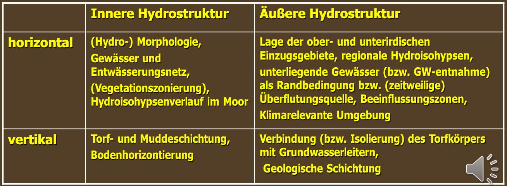

# Regionale Hydrologie

Inhalt des Moduls sind die Aspekte der Regionalisierung hydrologischer Größen, des Maßstabsproblems in der Hydrologie und der regionalen Bestimmung hydrologischer Parameter in unbeobachteten Gebieten.

## Moorhydrologie für Hydrologen

In diesem Abschnitt ist eine Zusammenfassung aus dem Vertrag "Moorhydrologie für Hydrologen" [@S-REG-Moor].

### Allgemeine Begriff

**Moore** sind "Landschaften ..., in denen **Torf gebildet** wird oder oberflächig anseht. Es werden damit auch *Lebensräume* eingeschlossen, in dennen noch **kiene deutlichen Torfschichten vorhanden** sind, ..., in denen jedoch **Torfbildung möglich** ist." (Joosten and Succow 2001, S. 2)

Geologische (rohstoffwirtschaftliche) und bodenkundliche Difinitionen: die von Mindest**trof**mächtigkeiten ausgehen: 20, 30, 50, 80, 120.

Problem: **Schnelle Veränderlichkeit** gringer Torfmächtigkeiten.

**Torf** (Koppisch 2001, S.8)

-   eine organische, sedentäre (von untern nach oben aufgewachsene) Ablagerung

-   äberwiegend aus abgestorbenem, humifiyiertem Pflanzematerial besteht

-   das (meist auf Grund eines durch wassersättigung verursachten Sauerstoffmangels) nicht vollständig abgebaut wurde und

-   dessen Sturktur zumindest teilweise noch erkennbar ist

Torfarten:

-   **Moostorfe**: Braun**moos**torfe mit Untergruppen

-   **Riedtorfe**: Woll**gras**, Blasenbinse, Grobseggen, Fein**seggen**, Salzweiden, binsenschneide, Schilf, Pfeiffengras ...

-   **Holztorfe**: Kiefer, Fichte, Birke, Erle, Eberesche, Reiser

-   amorpher Torf

Humosität der Torfe, Humus

Limnische Moorsubstrate / -sedimente --= Mudden, anorganische See- und Quellsedimente

### Wachsenden Moore: Akrotelm und katotelm

moorhydrologische Hauptsatz 1.

Das Wasser muss im langfristigen Mittel nahe an, in oder über der Oberfläche stehen, damit Torf akkumuliert wird, das Moor also wächst. (Schneebel mdl. 1991)

Akrotelm: der obere Bereich wassersender Moorökotope und umfaßt den Moorboden und die Vegetationsschicht, sofern in dieser Porenstrümung stattfinden kann. (Stegmann, Edom und Koska 2001)

Katotelm: der ständig wassergesättigte Bereich des Torfköpers mit relativ geringer biologischer Aktivität.

moorhydrologische Hauptsatz 2.

Durch Oxidationsprozesse (Belüftung, loneneintrag) und Druck (Auflastveränderung) verändern sich die hydaulischen Eigenschaften des Torfes, insbesondere verändern (meist verringern) sich die Porengrößen und damit Porositäten, Speicherkoeffizient und hydauliche Leitfähigkeit. (Edom 2001)

Moorentwässerung führt zu:

-   weitreichende Bodenstrukturänderungen (Degeneration, Degradation)

-   Freisetzung von Nährstoffen (P, N) und anderen Stoffen (SO4, DOC Huminstoffe)

-   Verbrennung von Torf zu CO2 ???

-   Schrumpfung des Reliefs

-   Verlust an Biodiversität bzw. wertvollen / seltenen Arten / Biotopen

Das Ausmaß dieser Prozesse ist hydrologieabhängig

Umwelt- und Naturschutzprobleme steigen mit Grad der Degradierung

### Bedeutung der Moore

1.  Biodiversität: Arten-, Biotop- und Prozessschutz: Eigenwert der Natur
2.  Gewässerschutz bzw. -verschmutzung: P, N, S, Fe, DOC
3.  Bestandteile von Gewässereinzugsgebieten und wasserwirtschaftlichen Systemen, häufig Quellgebiete von Flüssen oder flussbegleitend (Wasserregulierungsfunktion)
4.  Klimaschutz: Kohlenstoffspeicher (- doppelt soviel wie in Wäldern der Erde), klimarelevante Gase, Verdunstungskühlung, Feuer-Gefahrenquelle
5.  entwässerungsabhägige Nutzungen: Torfabbau, Landwirtschaft, Forstwirtschaft
6.  "nasse" Nutzungen: Paludikulturen (Wasserwälder, Halmniomasse, Torfmoose), Nahrungserwerb (Beeren, Jadg), Medizin (Pflanzen, Huminstoffe)
7.  Identität, Schönheit, Ästhetik sowohl von natur- als auch Kulturlandschaft
8.  Informationsfunktion, z.B. Speicherung der Vergangenheit (Leichen, Siedlungsreste, Pollen, Pflanzenreste, Hüttenstäube u.a.)
9.  Kulturhistorische Barrierefunktion und räumliche Schutzfunktion natürlicher bzw. nasser Moore
10. Trägerfunktion (Bebauung, Infrastruktur), Gfängnisse, tiefere Lagerstätten (v.a. Öl und Gas)

### Moor- und Torfbrände

In der Anfangsphase meist als Flächenbrände --= schwarzes Land

Torfbrände in der fortgeschrittenen Phase, meist in entwässerten Mooren als besonders extreme Moordegeneration =-- wasserstands- und feuchte-anhängig.

Pyroyse auch bei Saustoffabschluss und bei scheinbar gelöschtem Brand

"Glutnester" meist in der Pyrolysezone, auch beim Torfkoks.

Gringe Wärmeleitfähigkeit von Torf =-- "Glutnester" können überwintern und Brandherd kann im Frühjahr/ Sommer wieder erneut "auflammen"

### Vegetations-Wasser-Abhängigkeiten

Durch den Torfbildungsprozeße sind stabile Vegetationsformen sowohl Folge als auch Ursache satndörtlicher hydrologischer eigenschaften. deshalb ist der Zusammenhang zwischen hydrologiscchen eigenschaften und Vegetationsbedeckung in wachsenden Mooren besonders eng.

### Wasserstand und klimarelevante Gase

Kohlendiocid, Methan, Lachgas

gasaustauschen

### Hydraulik von Moorböden und Torf

#### Akrotelm (oberflächenah natärl. Moor)

Entwässerbare Porosität (Speicherkoeffizient)

$$
n_e(z)=n_{Kat}+(n_0-n_{Kat})\cdot e^{\frac{-z}{m}}
$$

Hdraulische Leitfähigkeiten: (Edom et al. 2007)

$$
k_f(z)=k_{Kat}+(k_0-k_{Kat})\cdot e^{\frac{-z}{m}}
$$

(Edom 2001)

$$
k_f(z)=\frac{k_0}{(z+1)^m}
$$

#### Katotelm

Abhängig von Torfart, Humositätsgrad / Zersetzungsgrad H, substanzvolumen SV. (succow & Joosten 2001)

Veränderungen kf-Werte mit der Zeit

"Durch Oxidationsprozesse ... und Druck ... verändern sich die hydraulischen Eigenschaften des torfs, insbesondere verändern (meist verringern)sich die ... hydraulische Leitfähigkeit." (Edom 2001)

Kosov 1987:

$$
k_f=k_0(T+1)^{-m_{KOS}}
$$

$T$ ist ENtwässerungszeit in Jahren;

$m_{KOS}$ von Entwässerungsität und Torfart abhängiger Koeffizient

Unndin 1964:

$$
k_f=k_0\cdot e^{-cz_E}
$$

$z_E$ in m für Landwirdschaft und Düngung, $c$ ist die Koeffizient zur Brücksichtigung der Zeit

### Die hydroloisch relevante Raumstruktur eines Torfkörpers

Bild aus Kript [@S-REG-Moor].

### Klimarelevante Umgebung

Strahlungsfilterung Romanov-Gleichung (Romanov 1961):

$$
ET_{Mire}=\alpha \cdot RN+Adv
$$

#### Strahlung Bilanz

$$
RN=R_K-R_L
$$

Kurzwellige Einstrhlung $R_K$ (s. Dzck 1980b, Dvwk 1996):

$$
R_K=(1-\mu)\cdot R_{G}=(1-\mu)\cdot R_{ex}\cdot [0.19+0.55(1-w)(1-b_a)(1-b_i)]
$$

(Edom 2001)

$\mu$: Albedo (Reflexionsvermögen) der Mooroberfläche;

$R_G$: beschattungsreduzierte Globalstrahlung, die im Falle $b_a=b_i=0$ (keine Beschattung) der üblichen Globalstrahlung entspricht;

$R_{ex}$: extraterrestrische Strhlung (s. Dzck 1980b, Dvwk 1996);

$(1-w)\cong h/H=t_s$: relative Sonnenscheindauer;

Langwellige Ausstrahlung $R_L$ von Mooroberflächen (nach Bavina 1967 und Autoermkollektiv 1976):

$$
R_L=\sigma T_M^4\cdot {\rm f}(W)\cdot {\rm g}(e)=\sigma T_L^4\cdot {\rm f}(W)\cdot {\rm g}(e)+\Delta R_L
$$

$\sigma=5.67\times10^{-8} \;[{\rm J/(m^2K^4s)}]$: Stefan-Boltzmann-Konstante;

$T_M,\,T_L\;[{\rm K}]$: Temperatur der Moorbodenoberfläche, Lufttemperatur in 2m Höhe;

${\rm f}(W)$: Bewölkungsfunktion nach Efimova (1961) mit:

$$
{\rm f}(W)=1-{\rm c}(\varphi)\cdot W \cong (1-{\rm c}(\varphi))+{\rm c}(\varphi)\cdot t_s
$$

${\rm c}(\varphi)$: von der geographischen Breite $\varphi$ abhängiger Koeffizient, wobei zwischen $45^\circ$ und $75^\circ$nördlicher Bereite gilt:

$$
{\rm c}(\varphi)=0.7+0.004(\varphi-45)
$$

Aber bei allen Penman-Monthith (Penman 1948):

$$
{\rm f}(W)=0.1+0.9t_s
$$

${\rm g}(e)$: Dampfdruckfunktion nach Efimova (1961), in Mitteleuropa die Dampfdruckfunktion (auch Nettoemissivität) der FAO-Richtlinie (s. Doorenbos & Pruitt 1997, Dvwk 1996, Dyck & Peschke 1995) anwendbar:

$$
{\rm g}(e)_{FAO}=0.34-0.044\sqrt{e}
$$

$e$: Dampfdruck der Luft in 2m Höhe in [hPa];

$\Delta R_L$: Ausstrahlungsverbesserung auf den Temperaturunterschied $\Delta T$ zwischen Moorboden- und Lufttemperatur für satbile Luftschichtung (Bavina):

$$
\Delta R_L\cong 4\sigma T^3\Delta T
$$

| Symbol       | Moor       | Apr. | Mai. | Jun. | Jul. | Aug. | Sep. | Okt. | Quelle    |
|--------------|------------|------|------|------|------|------|------|------|-----------|
| Albedo $\mu$ | Hochmoor   | 0.16 | 0.16 | 0.16 | 0.16 | 0.16 | 0.16 | 0.18 | kollektiv |
|              | Niedermoor | 0.10 | 0.17 | 0.2  | 0.2  | 0.2  | 0.18 | 0.16 | 1976      |
| $\Delta T$   | Hochmoor   | 0    | 0.9  | 1.4  | 1.4  | 0.6  | 0    | -0.9 | Bavina    |
|              | Niedermoor | 0.7  | 1.6  | 1.8  | 1.4  | 1.2  | 0.2  | -0.4 | 1967      |

#### Advektive Effekte

Für große Moore, Zentren großer Moore, windgeschütze Moore, Moore in feuchten oder kalten Regionen (Romanov 1962):

$$
Adv=0
$$

$$
ET_{Mire}=ET_\infty 
$$

Für kleine Moore, Randbereiche großer Moore, windexponierte Moore, Moore in trockenen oder Warmen Regionen **Advektion kann dedeutend sein** (Bavina 1967):

$$
ET(x)=ET_\infty+(ET_0-ET_\infty)\cdot e^{-n_ax}
$$

na=??? (Versinin 1976)

### Innere Hydrostruktur vertikal

-   Bodenzonierung

    -   Enge hzdrauliche Schichtung in natürlichen und degradierten Moorböden

    -   Schnelle zeitliche Veränderlichkeit

    -   Hohe räumliche Heterogenität

-   Torfschichtung (Katotelm)

    -   Hydaulische Schichtung nach Torfart und Humifizierung (Zersetzung), Anisotropie

    -   Hydraulische Fenster, stauende und durchlässige Schichten

### Innere Hydrostruktur horizontal

Hydromorphologie ist der Teil der Geomorphologie, der sich mit den wassergeprägten Formenelementen der Landschaft und ihren Interaktionen beschäftigt. Ein Moor sowie seine Teile sind wassergeprägte Formenelmente.

Die Verbindung mit Methoden der quantitativen Hydrologie erlaubt die Erklärung ursächlicher Zusammenhänge, die mathematische Modellierung und die Prognose von wassergeformten Landschaftselementen.

#### Natürliche Moore

In wachsenden Mooren ist das Mesorelief der Mooroberfläche weitgehend parallel zur Moorwasserspiegeloberfläche. Deswegen können die Mesoreliefformen der Moore ebenso wie die Oberfläche des Grundwasserkörpers mit den Methoden der Geohydraulik beschrieben werden. (Edom 2001)

(Ivanov 1975):

$$
\frac{{\rm d}y}{{\rm d}l}(s)=\frac{q_0b_0+\int_0^sp_lb_l\,{\rm d}l}{M_z(s)b_s}=\frac{q_0b_0+\int_0^sp_lb_l\,{\rm d}l}{b_s\int_{z_u}^{z_m}k_f(z){\rm d}z}
$$

Für jedes Segment eines Sektors berechnet sich aus der langjährigen mittleren Wasserbilanz (Edom & Golubcov 1996):

der spezifische Profildurchfluß:

$$
q_s(i)=\frac{q_0b_0}{b(i)}+\frac{\sum_{j=1}^i[A_j(P+q_{GW}-ET)_j]}{b(i)}
$$

die erforderliche (regenerierende, selbsttregulierte) durchströmte Transmissivität (Torfkörper oder Akrotelm):

$$
T_S(i)=\frac{q_0b_0}{b(i)\frac{{\rm d}y}{{\rm d}l}(i)}+\frac{\sum_{j=1}^i[A_j(P+q_{GW}-ET)_j]}{b(i)\frac{{\rm d}y}{{\rm d}l}(i)}
$$

der genetische Mineralwasseranteil (Minerogenie-Quaotient):

$$
H_O(i):=\frac{q_0b_0+\sum_{j=1}^i[A_jq_{GW}(j)]}{q_0b_0+\sum_{j=1}^i[A_j(P+q_{GW}-ET)_j]}
$$

der trophische wirksame Mineralwasseranteil (Minerogenie-Quaotient):

$$
H_U(i):=\frac{q_0b_0+\sum_{j=1}^i[A_jq_{GW}(j)]}{q_0b_0+\sum_{j=1}^i[A_j(P+q_{GW})_j]}
$$

#### Anthropogen gestörter Moore

Relief, Stromlinien, Gräben und Torfmächtigkeit in der Solbrigshaide (Erzgebirge)

1.  Geodätische Aufnahme des gesamten aktuellen Reiliefs und Graben- und Gewässernetzes
2.  Konstruktion der Stromlinien
3.  Konvergent $\rightarrow$ Zunahme des Profildurchflusses: Erklärung für (potentiell) naürliche Moorentwässerung (Rüllen, Bäche, Karst) und rheotrophische Phänome
4.  Divergent $\rightarrow$ Abnahme des Profildurchflusses: Erklärung für (potenziell) wachsende Ombrotrophie; häufig in zentralen, "moor-typischen" Bereichen

Quantitative hydromorphologische Analyse:

-   spezifische Profildurchlässigkeit (Solbrigshaide) [L/(s km)]

-   Potentielle oder erforderliche Transmissivität [cm2/s]

    -   Nach Vernässung: Wasserkonzentration in Strömungsrinnen und Senken, Wasserarmut in aufgewölbten oder divergenten Bereichen

-   Minerotrophie-Quotient (Hangwasseranteil)

### Probleme bei unzureichend hydrologisch fundierten Moorvernässungsprojekten

1.  Zuviel Wasser:

    -   Wasser steigt zu stark oder nach an ungewünschten Stellen (benachbarte Nutzflchen, Gräten, Häuser / Keller, Infrastruktur) an bzw. geht ungewünscht die Moorvernässung verloren

    -   neue, ict erwartete Wasserläufe bzw. -fließbahnen oder hydraulischer urzscluss

    -   Erosion in oder um die Staue bzw. im (vernässten) Torf

    -   Entstehung unerwünschter Methanquellen bzw. unerwünschter (zeitweiliger) Stoffauswaschungen

2.  Zu wenig Wasser

    -   Wasser steigt überhaupt oder nicht bis zum gewünschten Niveau an (oder) fließt andenorts ab

    -   Der Wasserentstieg an einem Ort für zur Entwässerung eines anderen

### Moorspezifische Wasserhaushaltsprozesse:

#### Statischer Speichervorrat:

-   Gesamtes Wasservolumen des Katotelm: 85 - 95 Vol. %

-   Sinkt mit Moorentwässerung (Katotelmobergrenze) bzw. Komprimierung

dynamische Speichervorratsänderung:

$$
\Delta S=\Delta S_{Hy}+\Delta S_{Pfl}
$$

$\Delta S_{Hy}$: Hydrolodynamisch wirksamer speicher;

$$
\Delta S_{Hy}=\Delta S_{Wk}+\Delta S_{Pv}+\Delta S_{Mu}+\Delta S_{Fl}
$$

$\Delta S_{Wk}$: Dynamischer Wasserkissenspeicher

$\Delta S_{Pv}$: Dynamischer Porenwasserpeicher

$\Delta S_{Mu}$: Muldenpeicher zwischen Mikroreliefelementen

$\Delta S_{Fl}$: Zeitweiliger Überflutungsspeicher

$\Delta S_{Pfl}$: Pflanzenphysiologisch wirksamer speicher.

#### Dynamischer Speicherprozess

Für die Bewegungen der Mooroberfläche sind Gewichtskraft, Auftrieb, Druckspannungskraft und Zugspannungskraft veranlwortlich. Die Gewichtskraft ($G$) beruht auf der Masse der Bodenteilchen. Dabei isl das Gewicht der über dem Grundwasserspiegel und der unter dein Grundwasserspiegel liegenden Partikel zu unterscheiden, Bei letzteren wird vom Eigengewicht der unter Wasser liegenden Teile ($G_P$) gesprochen. Das Gewicht aller Kompartimente über dem Grundwasserspiegel sei Auflast ($G_{üw}$) genannt. Von $G_{üw}$, getrennt betrachtet wird die Auflast von Bäumen und anthropogenen Elementen ($G_{BA}$). Auftrieb erfährt nach dem Archimedischen Prinzip jeder in eine Flüssigkeit eingetauchte Körper. Die Auftriebskraft ($F_A$), entspricht dem Gewicht der von ihm verdrängten Flüssigkeitsmenge. Je nachdem, ob $F_A$ im Vergleich zum Gewicht des Körpers größer, kleiner oder gleich ist, spricht man von Steigen, Sinken oder Schweben. Ein schwebender Körper verdrängt also genau die Wassermenge, die seinem igengewicht entspricht. Er hat dann, wie Wasser, die Dichte 1. Druckspannungskraft ($F_{DT}$) und Zugspannungskraft ($F_{ZT}$) beschränken die vertikale Verformung eines Körpers und werden unter dem Begriff der "Normalspannungskraft" zusammengefaßt. Hierbei wirkt F„ einer Komprimierung, $F_{DT}$ einer Dehnung entgegen.

$$
F_A+F_D=G_P+G_{üW}+G_AB+F_ZT
$$

#### Abflussbildung in Mooren: Postulate

Die hydaulik entwässerter Moorböden ist anders. Die Abflusskonzentration verläuft schneller wegen dichtem Grabennetz.

-   Moore reagieren je nach Hydromorphologie, hydraulischer struktur, landschaftlicher Position, ausgangswasserständen und Aufbau des Grabennetzes individuell.

-   In den HW-relevanten Moorlandschdten Mitteleuropas haben die Moore die geringsten Gefälle (nicht die HW-tragende Landschaft)

-   In der Mehrzahl sind natürliche oder revitalisierte Moore vermutlich (und Flusstalmoore sicher) abflussausgleichend

Bei hohen Wasserstände hohe Prositäten und Leitfähigkeit: kurzzeitiges hohes Speichervermögen, relativ schneller abfluss; bei niedrigen Wasserstände geringe Prositäten und Leitfähigkeit: langsamer Abfluss bis zum Versiegen.

### Ökohydrologie

Durch den Torfbildungsprozess sind stabile Vegetationsformen sowohl Folge als auch Ursache standörtlicher hydrologischer Eigenschaften. Deshalb ist der Zusammenhang zwischen hydrologischen Eigenschaften und Vegetationsbeckung in Mooren besonders eng. (Edom 2001)

Moorrelevante FFH-Lebensraumtypen (LRT)

]()

#### Prblem bei der derzeitigen Interpretation der FFH-RL

1.  Kartier- und Bewertungsschlüssel für Lebensraumtypen sind vorwiegend auf vegetationskundlicher Grundlage erstellt. QUalifizierte abiotische Betrachtung (Hydrologie, Torfe) fehlt bis auf seltene Ausnahmefälle (Sondergutachten).
2.  Räumliche Zusammenhänge zwischen den LRT und auch anderen Mooren werden vorwiegend aus Gründen des Artenschutzes (Biotop-Verbund) betrachtet. $\rightarrow$ Wechselwirkungen sowie gegenseitige Beeinflussungen durch fließendes Wasser können nicht hinreichend beurteilt werden.

#### Vorschlag erweiterter Begriffe

-   gLRT, (moor-) genetischer LRT - Vergangenheit:

    -   Der Lebensraumtyp am Standort, der das anthropogen unbeeinflußte Entwicklungsstadiu des Moores am Ort repräsentiert. Zu ermitteln anhand der oberflächennahen Torfe bzw. der Torfe unterhalb der degradierten Bodenhorizonte.

-   vLRT, vegetationskundlich LRT - Gegenwart:

    -   Der nach vegetationskundlichen Kriterien ausgewiesene Lebensraum, meist nach den Kartiervorschriften der EU-Mitgliedsländer festgelegt.

-   hLRT, hydromorphologischer LRT - Zukunft (nach Moorregeneration):

    -   die aus einer hydromorphologischen analyse und Modellierung abzuleitenden Entwicklungspotenziale (Edom & Golubcov 1996a, b)

### Hydromorphologisches Modell des Torfwachstums

$$
\frac{{\rm d}y}{{\rm d}l}(s)=\frac{q_0b_0+\int_0^sp_lb_l\,{\rm d}l}{b_s\int_{z_u}^{z_m}k_f(z){\rm d}z}
$$

Element-Akkumulation im akrotelm:

$$
\Pi_M(s)A_s=\int_0^s\Pi_M(l)b_l{\rm d}l=q_0b_0c_0+\int_0^s(Pc_p+q_{GW}c_{GW}D_{tr}-E_G)b_l{\rm d}l-q_sb_sc_s
$$

Kombination:

$$
\frac{\Pi_{M-a}(s)A_s}{c_{s-a}^r-c_{s-a}}=\frac{{\rm d}y}{{\rm d}s}b_s\int_{z_U}^{z_m}k_f(z){\rm d}z
$$

### Moortypen / -klassifikation

-   Hochmoore: Torfmoos- und Wollgrastorfe, ombrogene Wasserspeisung, oligotrophe Vegetation.

-   Niedermoore: Riedtorfe, geogene Wasserspeisung, meso- bis eutrophe Vegetation Weitgehend gültig in sehr ebenen landschaften wie Niederlanden oder Niedersachsen.

## Karst

### Begriff und Bedeutung

Karst ist der deutsche Name (slowenisch - Kras) für eine von Kiefernwäldern, Wiesen und Weiden geprägte Landschaft Sloweniens im Hinterland von Triest.

Besonderheiten gegenüber anderen Regionen:

-   Trotz hoher Niederschläge und humider Klimabedingungen prägen abflusslose trockene Holform und fehlender oberflächlicher Abfluss;

-   587 bekannte Höhlen;

-   der Fluss Reka verschwindet am südöstlichen Rand des Plateaus in der Hählen von San Kanzian;

-   am nordwestlichen Rand schütten die Timavo Quellen mit über 30.000 Liter pro Sekunde.

Seit 16. - 19. Jahrhundert wurde der Landschaftesname Karst mit diesen spezifischen Phänomen verbunden.[s.1]

Seit weiterer grundlegenden Arbeite ist Karst ein Wissenschaftsbegriff, der sich international durchsetzte und heute übergeordnet eine multidisziplinäre und interdisziplinäre Wissenschaft kennzeichnet.

Alle in Karstlandschaften auftretenden Phänomene, Processe und vorhandenen ökologischen Aussttungen werden heute weltweit unter dem Befriff "Karst" subsumiert.

-   Petrographie

-   Geologie

-   Paläontologie

-   Archäologie

-   Geomorphologie

„Karst ist jeder Landschaftstyp, in dem infolge der Klüftigkeit und Löslichkeit des Gesteins ein
Teil oder die Gesamtheit der Wässer aus Niederschlägen und/oder Oberflächengerinnen
(Rinnsale, Bäche, Flüsse) unterirdisch abfließen und in dem kennzeichnende, vorwiegend
der Korrosion zu verdankende oberirdische und unterirdische Landschaftsformen (Karstformen, Karsterscheinungen) auftreten können" (ÖWAV, 2007).

### Voraussetzungen (Entstehung ??)

Gemeisame Geofaktoren sind die unabdingbaren Voraussetzungen für ein Karstlandschaft.

-   Lösliche Gesteine, die in einem so hoch Maße mit Wasser oder wässrigen Lösungen reagieren, dass an der Lanoberfläche Lössungsformen und im Untergrund erweiterte Kluftsysteme und Höhlen entsthen.

-   Überwiegend unterirdische Entwässerung und nicht die in humiden Klimaten normale, oberflächliche durch Fließgewässer, oder flächenhaften Abfluss oder Süßwassernseen in Hohlformen gekennzeichnete Hdrographie.

-   Korrosionsbedingte spezifische Oberflächenformen, die in ihrer Verbreitung auf die mit diesen petrographischen und hzdrographischen Grundlagenausgestatteten Regionen beschränkt sind, bestimmen das Landschaftsbild.

Verkarstungsfähige Gesteine sind:

-   Karbonatgesteine wie Kalke und Dolomite

-   Evaporite (Salzgesteine) wie Gips, Steinsalz, etc.

-   Festgesteine mit wasserlöslichen Komponenten wie Konglomerate, Brekzien, Kalksandsteine, Mergel und Metamorphite

-   Lockersedimente mit wasserlöslichen Komponenten

### Entstehung / Entwicklung

Im Bereich der Erdoberfläche unterliegen alle Gesteine Veränderungen, die auf physikalische und chemische Prozesse im Kontakt mit der Atmosphäre, der Hydrospähre und der Biosphäre zurückgehen.

Diese als Verwitterung bezeichneten Veränderungen werden zwar von pedoklimatischen Bedingungen, dem Chemismus wässeriger Lösungen, organischer Substanz und der Zeitdauer gleichsinniger Prozesse gesteuert, aber wesentlich für die Intensität und den zeitlichen Ablauf ist der Mmineralbestand der Gesteine.

Physikalische Verwitterung:

-   Insolation

-   Desquamation

-   Kernsprenggung

-   Fortspregung

-   Salzsprengung

-   Wurzelsprengung

Die chemische Verwittung verändert den Chemismus der handenen Gesteine und wird in ihrer Intensität und Geschwindigkeit von der Reaktion der Minerale mit wässrigen Lösungen bestimmt.

-   Evaporite (die Chloride und Sulfate der Alkali- und Erdalkalimetalle) reagieren durch Hydratation.

-   Karbonate und Silikate reagieren mit H und OH Ionen des dissoziierten Wassers.

-   Silikate reagieren mit wässerigen Lösungen mit Hydrolyse, aber diese Prozesse laufen sehr langsam ab.

[Tab. 3.2 S.34]

### Karst Arquifers

Karst auifer is the main part of a karst water system. On a volume basis, it recevies, stores, and transmits more water than all surface streams within the system combined.

Ein verkarsteter Gesteinskörper kann in den Hohlräumen Grundwasser speichern und weiterleiten, daher die Bezeichnung Karstgrundwasser oder Karstaquifer. [MAK]

#### General Characteristics

Type of the hydrologeologic:

1.  Open hydrogeologic structure: Recharge and discharge zones are fully defined (know). 1a,1b
2.  Smei-open hydrodeologic structure: The aquifer is not entirely exposed to the surface, but the discharge zone is fully defined. 2a, 2b
3.  Semi-closed hydrodeologic structure: Recharge and discharge zones are only partially know or mostly unknow. 3a, 3b
4.  Closed hydrodeologic structure: The aquifer is completely isolated by impermeable geologic units and does not recevie recharge.

[fig. 1.12 P.12]

#### Porosity and Karsitifikation

Many quantitative prameters describing "life cycle" of water and contaminants (when present) within a groundwater system directly or indirectly depend on porosity.

Porosity (n) is defined as the percentage of voids (empty space occupied by water or air) in the total volume of rock, which includes both solids and voids:

$$
n=\frac{V_v}{V}\times 100 \%
$$

[fig. 1.29 p.28]

Rocks that have both matric and the fracture porosity are referred to as dual-porosity media.[p25]

[fig. 1.31 p.30]

Effective porosity is defined as the volume of interconnected pore space that allows free gravity flow of groundwater.

porosity type: matrix, fracture, solution

#### Karst Landform

All landforms specific to karst terrains, visible at the land surface and in the subsurface, are the result of carbonate rock dissolution (karstification) to varing degress.

[fig. 1.53 p.53]

-   sinkholes and other depressions:

    -   Sinkholes are the signature of karst terrains, they usually from at mecahanically weakened fracture intersections where water can easily percolate and flow deeper into the underlying rock carrying rock carrying away dissolved carbonates.[p54]

[fig. 1.53 p.55]

-   Kavities:

    -   Karst potholes and pits (international term for both is jama) are predominantly vertical karst cavities developed by water percolating through the vadose (unsaturated) zone. [fig. 1.83 p.73]

    -   Pit is defined as a deep hole, usually circular in outline, having vertical or nearly vertical walls.

    -   Caves, the predominantly horizontal karst cavities, are formed by the solution and mechanical action of flowing groundwater. [fig. 1.85 p.75]

### Karst Wasserhaushalt

[KHG fig 1.2 p3]

#### Allgemeine

Precipitation

As emphasized repeatedly, an analysis of precipiatation at all temporal scales is highly recommended ffor any project in karst.

-   Short period of site-specific data on precipitation, flow rate, and hydraulic head fluctuations.

-   Long-term data for natural hydrologic and climatic cycles.

A simple visual analysis of precipitation versus flow rate:

[fig. 1.164, p.157]

Evapotranspriation

PET (potential evatranspiration) is defined as the rate at which ET would occur from a large area completely and uniformly covered with growing vegetation, which has access to an unlimited supply of soil water and without advection or heat-storage effects.[p.172]

On a natural watershed with many vegeral species, it is reasonable to assume that AET (actual evatranspiration) rates do vary with soil moisture, since shallow-rooted species will cease to transpire before deeper-rooted species(linsley and Franzini, 1979).

P, E, ...

#### Groundwater flow

In karst aquifer there are types of porosity present, the hydaulic head are different to different types.

[fig, 1.134 p.125]

four flow types:

-   Darcy's flow through the rock matrix

    -   $Q=KiA$

-   Laminar and turbulent flow through fractures

    -   Fracture aperture is not constant and there are voids and very narrow or contact areas called asperities [fig 1.139 p.130]

    -   Fractures have limited lenghth and width, which can slao vary between individual fractures in the same fracture set. [p.130]

    -   $K=B^2\frac{\rho g}{12\mu}$

    -   [fig 1.140 p.130]

-   Laminar and turbulent flow under pressure through fully submerged conduits

-   Laminar and turbulent with free surface through karst channels

#### Channel flow

In many karst aquifers, the most important portion of ground water flow takes place in interconnected solution cavities that are commonly referred to as conduits or channels. By definition, a conduit has one dimension, length, disproporitionally large. [p. 132]

Most importantly, the traditional hydroulics of pipes (channels) is based on the principle of flow continuity, which assumes that there is no inflow or outflow of water through pipe walls. [p133]

flow rate:

$$
Q=\int_Avda 
$$

Flow rate in karst channels, which are not submerged (where the flow is with free surface), can be calculated using the Chezy-Manning quation:[p147]

$$
Q=A\frac{1}{n}R^{2/3}i_0^{1/2}
$$

#### Aquifer recharge

Aquifer recahrge is the most important water budget component of a karst system.

Recharge water enters the Aquifer through sinkoles, swallow holes, and sinking streams. Surface streams are scare because most of the water is quickly routed underground through solution openings. In the subsurface, water moves through caverns and other types of large solution openings.[p17]

Aquifer recharge ia both a probabilistic and a determinisc process: if and when it rains (laws of probability), the infiltration of water into the subsurface and the eventuel recharge of the saturated zone will follow physical laws.[p153]

Autogenic Recharge

Direct recharge by precipitation of a karst aquifer exposed (outcropping) at the land surface is usually called automagenic.

Allogenic recharge

Sinking of surface streams is one of the main characteristics of karst terrains. It provides direct aquifer recharge with large quantities of water on a continuous or, in case of intermittent streams, semicontinuous basis.

[fig. 1.195 p.191]

#### Springs

Spring is a location at the land surface where groundwater discahrges from the aquifer, creating a visible flow. This discharge is caused by difference in the elevation of the hydraulic head in the aquifer and the elevation of the land surface where the siacahrge is taking place.[p.194]

-   Gravity springs emerge under unconfined conditions where water table interesects land surface.

    -   Desending contact spring: when the contact between the water-bearing rock and the impermeable underlying rock is sloping toward the spring, in the direction of groundwater flow, and the aquifer is above this impermeable contact. [fig. 1.202a p.196]

    -   overflowing contact spring: when the impermeable contact slopes away from the spring, in direction opposite of the groundwater flow. [fig. 1.202b p.196]

-   Barrier springs: the term generally refering to springs at any lateral contact between the aquifer and a low-permeable rock (sediment). Such contact an have many different shapes aused by depositional procesases and tectonic movements that from a varity of faults and folds.

[fig. 1.205 p.198]

-   Submerged (subaqueous) springs: Discahrge of groundwater into surface streams and other water bodies may occur below the surface water level and may not be immedaitely visible.[fig. 1.212 p.203]

-   Estavelle: spring with dual function: it spring during high hydraulic heads in the aquifer, and as surface water sink during periods when the hydraulic head in the aquifer is lower than in the body of surface water. [fig. 1.215 p.205]

### Karst in Deutschland

### Trinkwasser im Karst

An den Komfort, die Sicherheit und vor allem die Zuverlässigkeit der Wasserversorgung haben sich moderne Gesellschaften längst gewöhnt. Heute ist der direkte Kontakt zum Ursprung des Wassers verloren gegangen, da es billig und sicher in jedem Haushalt zur freien Verfügung steht. [MAK]

Für die Trinkwasserversorgung werden vorzugsweise unterirdische Wässer (Grund- und Quellwasser) herangezogen. Diese sind wegen ihrer Bodenüberdeckung besser gegen Umwelteinflüsse und gegen einen Schadstoffeintrag geschützt als Oberflächenwässer.

Im Allgemeinen gilt Grundwasser für Trinkwasserzwecke als hygienisch beste Art der Wasserversorgung (Kainz et al., 2012).

-   Poren-Grundwasser

-   Kluft-Grundwasser (nicht verkarstetes Festgestein)

-   Karst-Grundwasser

    -   Festgestein mit Hohlräumen, verkarstungsfähiges Gestein (Karbonate)

    -   Großes Hohlraumvolumen besonders kompliziert und unregelmäßig

    -   Sehr hohe Fließgeschwindigkeit 15-400 m/d

Kommt es in einem Wasserversorgungsgebiet zu Wassermangel oder zur Verschlechterung der Wasserqualität, so ist es trotzdem notwendig das betroffene Versorgungsgebiet mit einwandfreiem Wasser versorgen zu können.

Unter Karstwasser wird die Gesamtheit unterirdischen Wassers in verkarstetem Gestein verstanden (ÖWAV, 2007).

#### Schutzzonen

Wesentliche Voraussetzung für einen nachhaltigen Schutz des Grundwassers ist die Ausweisung ausreichend großer Schutzzonen.

-   Schutzzone I -- Fassungsbereich: Die Schutzzone I dient dem Schutz des Fassungsbereichs einer Wassergewinnungsanlage und der dazugehörigen Bauten vor
    unmittelbar schädigenden Einflüssen.

-   Schutzzone II -- Engeres Schutzgebiet: Die Schutzzone II dient dem Schutz des
    Gebietes des Zuströmens zur Wasserfassung.

-   Schutzzone III -- Weiteres Schutzgebiet: Die Schutzzone III dient dem Schutz des
    hydrographischen Einzugsgebietes, welches entweder einer oder mehrerer Wasserfassungen zugeordnet werden kann.

Die Definition der Schutzzone I bleibt gleich. Dabei ist auch für Karstgrundwässer der unmittelbare Bereich der Quellfassung gemeint und somit besonders schützenswert. Charakteristisch für Karstgrundwässer ist die nicht ausreichende oder ehlende Filterwirkung bzw. Bodenpassage. Daher reagieren diese Wässer auf direkt von der Oberfläche eingebrachte Schadstoffe besonders empfindlich. Der Schadstoffeintrag kann on großer Entfernung über die Atmosphäre herangetragen werden. Daher sind Schutzmaßnahmen unabhängig von einer Zonierung, gebietsumfassend festzulegen (ÖVGW, 2004).

Karstgrundwasser gehört weltweit zu den wichtigsten Süßwasserressourcen. Etwa 25 % der Weltbevölkerung beziehen ihr Trinkwasser aus dem Karst (Glodschneider et al., 2004).

#### Wasserqualität

Durch die starke Polarität des Wassers, weist es eine hohe Bereitschaft auf, andere Stoffe zu lösen, vor allem solche die selbst polar sind -- dazu gehören viele Mineralien, wie Natrium, Kalium, Magnesium, Calcium, etc. Dabei werden die Salze im Wasser in elektrisch geladene Teilchen (Ionen) aufgespalten, wodurch sie für den Stoffwechsel von Menschen, Tieren und Pflanzen nutzbar werden (Merkl, 2008).

Die Qualität des Trinkwassers lässt sich sehr gut mit der regelmäßigen Kontrolle der Trübung und der Färbung überwachen. Trübstoffe können Farbträger sein oder es können neben Trübstoffen auch gelöste Farbstoffe im Wasser vorkommen.

Karstwasser unterliegt nicht nur Schwankungen der Ergiebigkeit, sondern auch teils starken Schwankungen der physikalisch-chemischen und mikrobiologischen Beschaffenheit. Schwankungen der Beschaffenheit (Wassertemperatur, elektrische Leitfähigkeit, pH-Wert, Trübe, etc.)

Verschiedene Untersuchungen zeigten den Zusammenhang zwischen Keimzahlen (KBE)
und Boden- und Vegetationsdecke (Kahl- oder Grünkarst). Bei Quellen deren Einzugsgebiet
ganz oder teilweise im Grünkarst liegt, kommt es üblicherweise nach Starkregen oder während der Schneeschmelze zum Anstieg der Keimzahlen.[MAK]

Weitere Untersuchungen zeigten, dass Dolomitkarstkörper geringere Keimzahlen als Kalkgebiete aufweisen.[MAK]

Zudem zeigen Karstquellwässer aus gemischten Einzugsgebieten (Kahl- und Grünkarst) geringere esamtkoloniezahlen als Karstquellwässer aus reinen Grünkarstgebieten.[MAK]

Karstgrundwasser ist in hohem Maß verletzlich (vulnerabel) gegenüber Schadstoffeinträgen. Meist ist die Deckschicht der Karstgrundwassereinzugsgebiete unzureichend ausgebildet, wodurch das einsickernde Niederschlagswasser keine nennenswerte Reinigung erfährt. Auch offene Spalten und Schächte stellen Gefahrenpunkte dar.

Verletzlichkeit und Empfindlichkeit

Karstformen wie Dolinen und Schwinden stellen punktuelle Infiltrationsmöglichkeiten dar, die eine sehr rasche Infiltration von Oberflächenwasser erlauben. Durch diese hohe Durchlässigkeit
von solchen Karststrukturen kann eine erhebliche Gefährdung der Wasserqualität ausgehen.

Problem

Das Karstwasser kann eine sehr hohe Qualität aufweisen und manchmal sogar ohne jegliche
Aufbereitung verwendet werden. Jedoch ist es empfindlich und kann dementsprechend leicht
durch Schadstoffeintrag beeinträchtigt werden. Die Bedrohungen sind sehr vielfältig und
werden im Folgenden beschrieben (Kralik, 2001).

Verschmutzungsverursacher -- negative Beeinflussung von Karstwasservorkommen:

-   Massentourismus (Hotels, Parkplätze, Autostraßen, Seilbahnen, Wandertourismus, Abwasserbeseitigung)

-   Landwirtschaft (im Einzugsgebiet, Tierhaltung, unsachgemäße Düngung, Pestizide, im voralpinen Karst)

-   Intensive Alm-(Vieh)wirtschaft (Wege, Steige, Erosionsrinnen, Vegetationsschädigung durch berweidung)

Schadstoffe:
- Bakteriologisch/Hygienische Belastung (Abwasser- und Fäkalkeime, Trübung behindert Entkeimung, oli Bakterien, Weidevieh, Wildtiere, Fäkalien)
- Mineralöle + Treibstoffe (von Schutzhütten, Seilbahnen, Pistengeräten und Generatoren, Straßen)
- Nitrat
- Trübungen (z. B.: nach Forststraßenbau, Feststoffe aus ausgewaschenen Böden, Erosion durch Starkregenereignisse, org. Substanzen)

