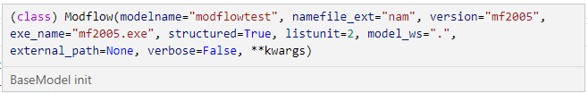
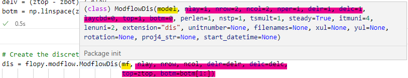
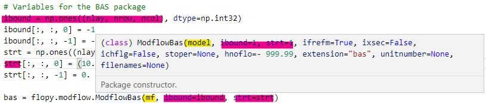
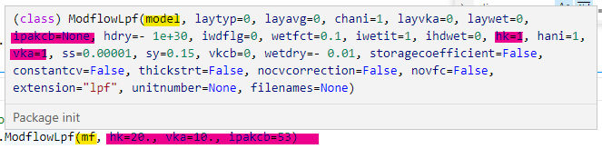
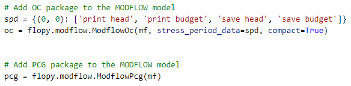
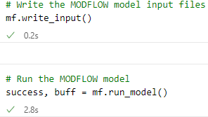
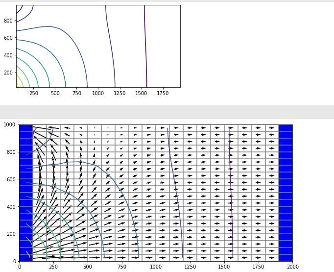

# Grundwasser (Fallstudien)

## FloPy

### Basic Modell stellen und laufen

1.  Modell Projekt aufstellen

    -   modelname --

    -   exename --

2.  Basic Stellung (Diskretisierung, Boundary, Structure, Schichteneigenschaften)

    -   DIS

    -   BAS

    -   LPF

3.  Output stellen

    -   OC

    -   PCG (finite difference equations)

4.  Modell laufen

    -   XX.write_input()

    -   XX.run_model()

5.  Post Process

    -   Daten aus FloPy binaryfile

        -   bf.HeadFile(model + 'hds')

        -   bf.CellBudgetFile(model +'.cbc')

    -   Plot mit matplotlib.pyplot

        -   plt.contor

    -   flopy.plot.ModelMap

        -   model

        -   layer

