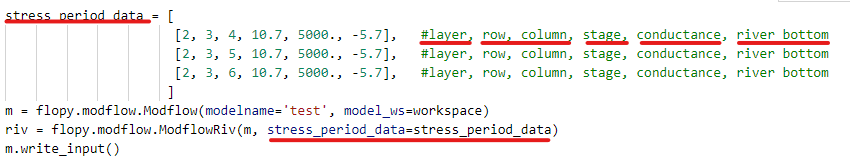
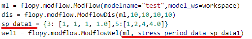
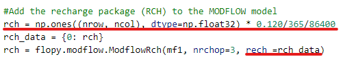
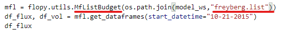
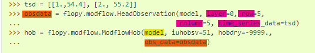

# Grundwasser (Fallstudien)

## FloPy

FloPy ist ein Python-Paket (Paket ist der Begriff von beide Python und MODFLOW, in dieser Bericht tragen "Python-Paket" als Python Paket und "Paket" als MODFLOW Paket) um MODFLOW und andere MODEFLOW-entsprechende Programme zu benutzen. Im Vergleich zu ModelMuseist es einfacher zur automatischen Stellungen und die Daten ist auch einfacher zu stellen. Trotzdem gibt es auch ein paar Nachteile, z.B. keine interaktive Darstellung und keine Parameter Liste. FloPy ist nur auch eine Arbeitsformen, die unterschiedlich als ModelMuse ist, die gründlichen Programme z.B. mf2005.exe sind noch benötig.

Alle Stellungen für ein Modell in FloPy sind die Funktionen auf Python, der Verlauf von einem numerischen Modell wird in fünf Schritten verteilt.

Davor muss man noch zwei Vorbereitungen machen, Daten für das Modell zu sammeln und die benötigen Python-Pakete z.B. flopy, numpy und matplotlib zu laden.

1.  Zuerst muss man ein neu Model-Projekt eatblieren mit Funktion "flopy.modflow.Modflow", dafür sind die Parameter modelname (der Projekt Name) und exename (das Programm, das Model zu rechnen) benötig.
2.  Dann stellt man die vorbereitete Daten in bestimmt Form, die Daten werden von unterschiedlichen bestimmten Pakete eingelesen und organisiert. Die Funktion für jedes Paket ist als "Modflow" plus Paket Name (Aber nur der erste Buchstabe ist Großschreibung) wie "flopy.modflow.ModflowDis" und "flopy.modflow.ModflowBas".
3.  Danach ist die Stellung von Output, die Output Stellungen kontrollieren die Output Ergebnisse und Dokumente, die notwendig für weitere Postprocess und Bearbeitung.
4.  Nach der vorgenannten drei Schritten kann man das Modell laufen mit Funktion "XX.write_input()" und "XX.runmodel()". Weil die Daten noch bei äußerliches Programm berechnet werden, ist es benötig, die Daten in bestimmte Form zu scchreiben.
5.  Am Ende werden die Ergebnisse dargestellt oder prüfen, also das Verfahren Postprocess.

### Basic Modell stellen und laufen

1.  Modell Projekt aufstellen

    -   modelname --

    -   exename --

2.  Basic Stellung (Diskretisierung, Boundary, Structure, Schichteneigenschaften)

    -   DIS

    -   BAS

    -   LPF

3.  Output stellen

    -   OC

    -   PCG (finite difference equations)

4.  Modell laufen

    -   XX.write_input()

    -   XX.run_model()

5.  Post Process

    -   Daten aus FloPy binaryfile

        -   bf.HeadFile(model + 'hds')

        -   bf.CellBudgetFile(model +'.cbc')

    -   Plot mit matplotlib.pyplot

        -   plt.contor

    -   flopy.plot.ModelMap

        -   model

        -   layer

### Randbediengungen

Aus [flopy3_modflow_boundaries.ipynb](https://github.com/modflowpy/flopy/blob/develop/examples/Notebooks/flopy3_modflow_boundaries.ipynb)

#### RIV

#### WEL

#### RCH

### Postprocess

#### Budget

Aus [flopy3_working_stack_demo.ipynb](https://github.com/modflowpy/flopy/blob/develop/examples/Notebooks/flopy3_PEST.ipynb)

#### HOB

#### PEST

Aus [flopy3_PEST.ipynb](https://github.com/modflowpy/flopy/blob/develop/examples/Notebooks/flopy3_PEST.ipynb)

Nur .tpl Datein zu schreiben, ohne PEST laufen.
