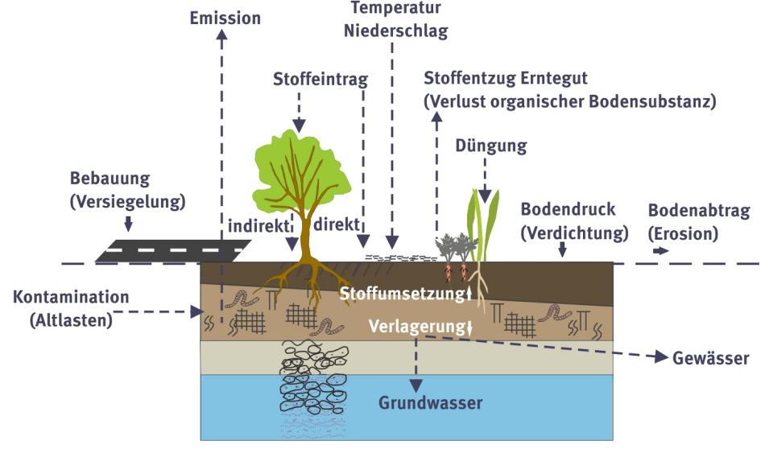
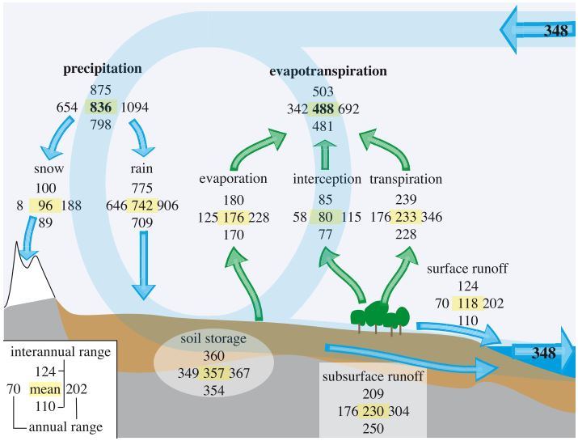
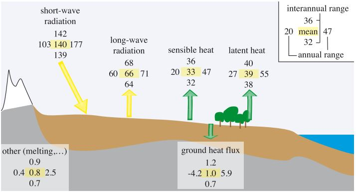
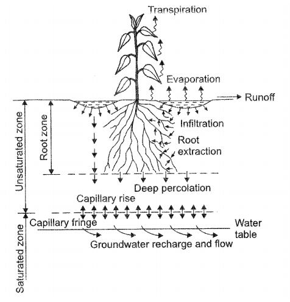
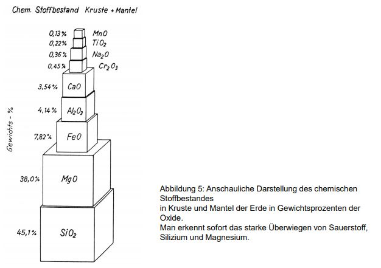
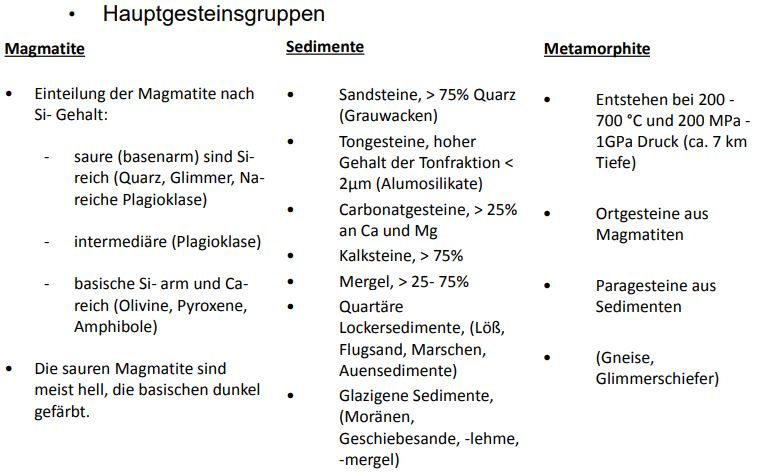

# Bodenwasserhaushalt

Inhalt des Moduls sind auf der Grundlage bodenkundlichen Basiswissens eine Einführung in die bodenphysikalischen Zusammenhänge und Prozessabläufe des Wasser- und Stofftransports in der Aerationszone des Bodens, die Abhängigkeiten der prozessrelevanten Kenngrößen und ihre Bedeutung für Parametermodelle, die gängigen Ansätze zur Transportberechnung und deren Aussagekraft und Gültigkeitsbereiche im Vergleich zu den in der Natur tatsächlich ablaufenden Prozessen.[@S-BWH]

Die Notizen basieren auf der Skript aus [@S-BWH].

Huaptinhalte:

-   geomorphologische, bodenkundliche und bodenphzsikalische Grundlagen

-   Modellvorstellungen yur Bodenwasserbewegung im Hinblick auf Aussagekrft, zugrunde liegende Vereinfachungen und Gültigkeitsbereich

-   mathematischen Umsetzung der Modellvorstellungen und Modellanwendung

-   Datenerhebung (Messung) und Parametrisierung

## Einführung

### Motivation

-   Der Boden ist die **Grenzschicht** zwischen der Atmosphäre und der Lithosphäre.

-   Über **90%** des effektiven Niderschlags werden in dieser Schicht umgesetzt.

-   Es ist der wesentlicher Teil des **BPA (Boden-Pflanze-Atmosphäre)** Systems und hat maßgeblichen EInfluss auf die Verdunstung.

-   Vielfältige **Wasser- und Stofftransportprozesse**, **Abbauprozesse** sowie **chemische und biologische Umsetzungen** finde hier statt.

### Der Boden und sein Merkmale

-   Als Boden bezeichnet man den **oberen belebten Teil der Erdkruste**

-   ein **Dreiphasensystem** bzw. Mehrphasensystem

-   Im **Porensystem** des Bodens sind alle Poren untereinander verbunden

-   es ist:

    -   Wasserspeicher

    -   Nährstoffspeicher und -reaktor

    -   Schadstoffspeicher und -reaktor

-   Die ökologische Qualität von Böden ist dynamisch und wird durch eine Viezahl von simulatan ablaufenden und vernetzen **physikalischen**, **chemischen** und **biologischen** Prozessen beeinflusst.

-   Viele dieser Prozesse werden dabei von mehreren nichtlinearen, bodenspezifischen Charakteristika beeinflusst.

### Der Boden und seine Funktionen

-   Zunahme der **bewässerten Fläche** um das 2,6 fache. (450 - 750 kg H~2~O / kg Trockensubstanz)

    -   Afrika, Asien \> 85% des Wasserverbrauchs

    -   EU \> 39%

    -   US \> 45%

-   eine Verdopplung der **Nahrungsmittelproduktion** erfolgen

-   **Klima** beeinflussen

    -   Verdunstung $\rightarrow$ Kühlung

    -   CO~2~ Quelle bzw. Senke

-   **Niederschlagswassers** in der Bodenzone

    -   Oberflächenabfluss

    -   Perkolation

    -   Stoffumsatz und Stofftransport, Sanierung

-   Faktoren für **Pflanzen**

    -   Raum und Halt (Durchwurzelbarkeit)

    -   Nährstoffspeicherung und -verfügbarkeit

    -   Wasserspeicherung und Wasserleitung

    -   Wärmerspeicherung

    -   Atmung (Gaspermeabilität)

    -   Leben (Bodenbiologie)

-   Filter, Puffer und Reaktor

-   Abbau von toxischen CHemikalien

-   **Reinigung von Wasser**

-   Regulation der Zusammensetzung der Atmosphäre

-   Grundwasserschutz

-   Oberflächenwasserschutz

-   Abslussbildung und Hochwasserschutz

-   Globaler Kohlenstoffhaushaltsregulierung

Bild aus S. Marahrens / Umweltbundesamt aus Skript [@S-BWH].

### Boden als Element im Wasserkreislauf

This section based on the book "Soil physics" [@KurtRoth.2012]

Physical enviroment:

1.  **atmosphere**

2.  **oceans**

3.  **terrestrial** environment

    -   soils and sediments

    -   snow, glaciers and ice

    -   vegetation, (depending on the perspective)

    -   surface waters like rivers and small lakes

Soils and icy ananlogues are structurally similar in that they are both soild **porous media** whose pore space is filled with liquid water and with air.

They both may be considered as a boundary region between the fluid compartments - atmosphere and oceans - and the soild lithosphere.

**Vegtation** may also be looked upon as another **boundary**, one between soil and stmosphere. While its most important function is arguably the assimilation of solar energy into carbon compounds by consuming CO~2~ and producing O~2~ $\rightarrow$ increase of the coupling between soil and atmosphere. Rooting system pervades the top soil layers and on the other by the stems and foliage that tap into the atmosphere.

Terrestrial water cycle [after Dirmeyer et al. 2006], from [@KurtRoth.2012]

Terrestrial energy fluxes [after Dirmeyer et al. 2006], from [@KurtRoth.2012]

### Bodenwasserhaushalt

Bild aus Hillel, 2008: Soil in the Environment, aus Skript [@S-BWH]

## Grundlagen

### Geologische und bodenkundliche Grundlagen

Chemische Zusammensetzung der Erdkrust / Mantel:

Bild aus [Strobach 1991], aus Skript [@S-BWH].

Hauptgestein

Bild aus Skript [@S-BWH].

### Bodenbildung und -entwicklung

Die wichtigsten Faktoren der Bodenbildung:

+--------------------------------------------------------------------------------+---------------------------------------------------------------------------------------------------------------------------------------------+
| Ausgangsgestein                                                                | Chemische Zusammensetzung                                                                                                                   |
|                                                                                |                                                                                                                                             |
| (Basis)                                                                        | Phzsikalische Beschaffenheit                                                                                                                |
|                                                                                |                                                                                                                                             |
|                                                                                | **Gefüge** (Locker- oder Festgestein, Porosität, Klüftigkeit),                                                                              |
+--------------------------------------------------------------------------------+---------------------------------------------------------------------------------------------------------------------------------------------+
| Klima                                                                          | **Sonnenenergie** (die mächtigste Triebkraft der Bodenentwicklung)                                                                          |
|                                                                                |                                                                                                                                             |
| (außer Wirkung)                                                                | --\>**Temperatur** (Zersetzung, Verwitterung und Mineralbildung.)                                                                           |
|                                                                                |                                                                                                                                             |
|                                                                                | **Niederschlag** --\> Sickerwasser                                                                                                          |
|                                                                                |                                                                                                                                             |
|                                                                                | **Wind** --\> erhöht die Verdunstung und Erosion                                                                                            |
+--------------------------------------------------------------------------------+---------------------------------------------------------------------------------------------------------------------------------------------+
| **Schwerkraft** und **Relief** (als die Position des Bodens in der Landschaft) | Versickerung                                                                                                                                |
|                                                                                |                                                                                                                                             |
| (kraft / inner Wirkung)                                                        | Auflast                                                                                                                                     |
|                                                                                |                                                                                                                                             |
|                                                                                | Höhenlage                                                                                                                                   |
|                                                                                |                                                                                                                                             |
|                                                                                | Exposition                                                                                                                                  |
|                                                                                |                                                                                                                                             |
|                                                                                | Hangneigung                                                                                                                                 |
+--------------------------------------------------------------------------------+---------------------------------------------------------------------------------------------------------------------------------------------+
| Flora und Fauna                                                                | Boden + Flora + Fauna = **Ökosystem**, Wchselwirkung mit allen anderen Faktoren der Bodenentwicklung                                        |
|                                                                                |                                                                                                                                             |
| (Wechselwirkung, öko)                                                          | Schutzwirkung (Vegetationsdecke wirkt wie ein Schutzmantel, Wurzeln und Mikroorganismen scheiden organische Säuren und Komplexbildner aus,) |
|                                                                                |                                                                                                                                             |
|                                                                                | Nährstoffentzug bzw. -Lieferung                                                                                                             |
|                                                                                |                                                                                                                                             |
|                                                                                | Umsetzung                                                                                                                                   |
|                                                                                |                                                                                                                                             |
|                                                                                | Durchmischung                                                                                                                               |
|                                                                                |                                                                                                                                             |
|                                                                                | Lockerung                                                                                                                                   |
+--------------------------------------------------------------------------------+---------------------------------------------------------------------------------------------------------------------------------------------+
| **Wasser**                                                                     | Abtrag bzw. Sedimentation                                                                                                                   |
|                                                                                |                                                                                                                                             |
| (Wechselwirkung)                                                               | Durchlüftungsverhältnisse                                                                                                                   |
|                                                                                |                                                                                                                                             |
|                                                                                | Redoxverhältnisse                                                                                                                           |
|                                                                                |                                                                                                                                             |
|                                                                                | Verlagerungsprozesse                                                                                                                        |
+--------------------------------------------------------------------------------+---------------------------------------------------------------------------------------------------------------------------------------------+
| **anthropogene** EInflüsse                                                     | Rodung, Ackerbau                                                                                                                            |
|                                                                                |                                                                                                                                             |
|                                                                                | industrielle Nutzung                                                                                                                        |
|                                                                                |                                                                                                                                             |
|                                                                                | Idw. bzw. forstliche Nutzung                                                                                                                |
|                                                                                |                                                                                                                                             |
|                                                                                | Degradierung                                                                                                                                |
|                                                                                |                                                                                                                                             |
|                                                                                | Entwässerung                                                                                                                                |
|                                                                                |                                                                                                                                             |
|                                                                                | Versiegelung                                                                                                                                |
|                                                                                |                                                                                                                                             |
|                                                                                | Bebauung                                                                                                                                    |
|                                                                                |                                                                                                                                             |
|                                                                                | Schadstoffablagerung                                                                                                                        |
+--------------------------------------------------------------------------------+---------------------------------------------------------------------------------------------------------------------------------------------+

-   EIne Veränderung in der herrschenden Konstellation kann der Bodenentwicklung eine neue Richtung geben.

In einem Boden laufen ständig Stoffumwandelungen und Stoffverlagerungen ab, die mit Energieumsetzung verbunden sind. Die Gesamtheit dieser simultan ablaufenden und häufig wechselwirkungen Prozesse bezeichnet man als Bodendynamik.

Prozesse der Bodenentwicklung:

1.  Verwitterung und Mineralbildung
2.  Bildung von Humusformen
3.  Gefügebildung
4.  Tonverlagerung
5.  Podsolierung
6.  Redoximorphose
7.  Carbonatisierung
8.  Versalzung
9.  Turbationen
10. Stoffumlagerungen in der Landschaft
